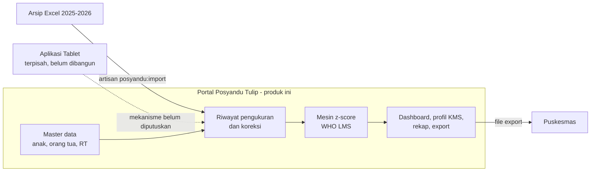

# Product Requirements Document — Portal Posyandu Tulip

| | |
|---|---|
| **Produk** | Portal Posyandu Tulip |
| **Versi dokumen** | 2.0 |
| **Status** | Approved untuk MVP |
| **Basis** | Revisi dari `PRD_DIGITALISASI_POSYANDU_TULIP.md` v1.0 |
| **Lokasi** | Posyandu Tulip, RW 18, Kelurahan Citeureup |

> **Perubahan utama dari v1.0.** v1.0 mengasumsikan produk ini sekaligus menjadi aplikasi pencatatan lapangan. Asumsi itu **salah**: pencatatan di hari-H akan ditangani Aplikasi Tablet yang terpisah. Seluruh bagian scope, persona, dan alur di dokumen ini sudah dikoreksi. Lihat [ADR-0003](adr/0003-batas-portal-vs-aplikasi-tablet.md).

---

## 1. Ringkasan

Portal Posyandu Tulip adalah aplikasi web internal untuk kader, Bidan, dan admin Posyandu Tulip. Portal menyimpan satu profil tetap per balita, satu riwayat pertumbuhan lintas bulan dan tahun, menghitung status gizi secara otomatis dari standar WHO, dan menghasilkan rekap yang selama ini disusun manual dari puluhan file Excel.

Portal adalah *system of record* dan pusat analitik. Portal **bukan** aplikasi input lapangan.

## 2. Masalah

Arsip Posyandu Tulip saat ini tersebar di puluhan file Excel yang terbagi tiga sumbu sekaligus: per bulan, per jenis laporan, dan per indeks Z-score. Akibat yang terukur dari inventaris data:

| Gejala | Bukti dari arsip |
|---|---|
| Identitas anak tidak stabil | 1.054 baris rekap 2025 menghasilkan **129 variasi nama** untuk **124 NIK** terisi. Ada kolom `NAMA_BAKU`/`PERBAIKAN_NAMA` yang dipelihara manual. |
| Identitas tidak lengkap | 8 baris tanpa NIK; 4 NIK memiliki **tanggal lahir yang saling bertentangan** antar file. |
| Riwayat anak terputus | Untuk melihat pertumbuhan satu anak, petugas harus membuka 12 file atau lebih dan mencocokkan nama secara manual. |
| Perhitungan terduplikasi | Z-score dihitung ulang di tujuh file berbeda (`0_REKAP ... Z SCORE ...`), masing-masing dengan formula sendiri. |
| Tipe data rusak | Nilai `PINDAH RUMAH` muncul di kolom berat badan. NIK terbaca sebagai angka sehingga nol di depan hilang. Berat lahir tercatat `2986` (gram) bercampur dengan `2.9` (kg). |
| Duplikasi file | `6_JUNI 2026_MASTER Z SCORE.xlsx` ada identik di dua folder berbeda. |

Konsekuensinya: rekap bulanan memakan waktu berjam-jam, angka antar-laporan bisa berbeda, dan anak yang perlu tindak lanjut bisa terlewat karena riwayatnya tidak terbaca sebagai satu garis.

## 3. Tujuan produk

| # | Tujuan | Ukuran keberhasilan |
|---|---|---|
| G1 | Satu identitas, satu riwayat per anak | Seluruh baris arsip 2025–2026 tergabung ke sekitar 129 profil anak; setiap konflik identitas terdokumentasi dan diputuskan manusia, bukan ditebak sistem. |
| G2 | Status gizi otomatis dan dapat ditelusuri | Z-score keenam indeks dihitung sistem; setiap hasil menyimpan versi standar yang dipakai. Selisih dengan perhitungan Excel yang berjalan kurang dari 0,01. |
| G3 | Riwayat pertumbuhan terbaca sekali lihat | Profil anak menampilkan kurva KMS dengan garis SD sebagai latar, tanpa membuka file lain. |
| G4 | Rekap tanpa kerja manual | Rekap per RT dan per periode, lengkap dengan kolom z-score, dihasilkan dari data — bukan disalin antar-spreadsheet. |
| G5 | Data lama tidak hilang | Arsip 2025–2026 masuk sistem lewat jalur impor yang punya jejak asal baris. |

### Non-goals

Hal berikut secara sadar **tidak** dikerjakan produk ini:

- Pencatatan pengukuran di lokasi Posyandu saat kegiatan berlangsung. Itu milik Aplikasi Tablet.
- Layanan di luar balita: ibu hamil, remaja, lansia, PTM/Posbindu, atau ILP enam siklus hidup.
- Portal untuk orang tua atau warga. Ini menuntut *informed consent*, kebijakan privasi, dan kontrol akses tersendiri yang belum tersedia.
- Integrasi otomatis ke e-PPGBM atau SIGIZI.
- Fungsi *offline* atau PWA. Portal dipakai di tempat yang memiliki koneksi.

## 4. Pengguna

Portal bersifat **internal**. Tidak ada akses publik dan tidak ada akun untuk orang tua.

| Persona | Konteks | Kebutuhan utama |
|---|---|---|
| **Kader** | Relawan RW, umumnya bukan pengguna komputer harian. Mengurus anak-anak di RT-nya. | Mencari anak dengan cepat, melihat riwayat dan status gizi anak binaannya, mengetahui siapa yang belum hadir. |
| **Bidan / Koordinator** | Penanggung jawab kebenaran data dan keputusan klinis. | Mengoreksi profil dan pengukuran, memutuskan penggabungan data duplikat, melihat seluruh RT, menyiapkan bahan laporan Puskesmas. |
| **Admin sistem** | Mahasiswa KKN atau pengelola teknis. | Mengelola akun dan peran, menjalankan impor arsip, mengelola periode kegiatan, dan *backup*. |

Peran diurutkan menaik: Kader < Bidan < Admin. Peran yang lebih tinggi memiliki seluruh hak peran di bawahnya.

## 5. Batas sistem

Garis putus-putus adalah *open issue*: cara Aplikasi Tablet menyerahkan data ke Portal (basis data bersama, impor berkala, atau API) belum diputuskan. Data model Portal dirancang netral terhadap ketiganya.

## 6. Lingkup

### 6.1 MVP

| Modul | Isi |
|---|---|
| **M1 — Master data** | CRUD anak, orang tua, dan wilayah RT. Pencarian berdasarkan nama, NIK, atau RT. Koreksi ejaan nama. Penandaan kandidat duplikat. |
| **M2 — Profil anak dan KMS** | Halaman detail anak: riwayat pengukuran dengan kolom z-score per indeks, kurva pertumbuhan dengan garis SD sebagai latar, riwayat layanan, form koreksi pengukuran. |
| **M3 — Status gizi** | Perhitungan otomatis z-score dan kategori untuk BB/U, TB/U, BB/TB, IMT/U, LILA/U, dan LIKA/U dengan metode WHO LMS. |
| **M4 — Dashboard** | Ringkasan periode berjalan: sasaran dan kehadiran (D/S), sebaran status gizi, tren stunting per RT dan periode, daftar anak yang perlu tindak lanjut. |
| **M5 — Periode dan rekap** | Pengelolaan periode kegiatan bulanan. Rekap per RT dan periode dengan kolom z-score. Export CSV/Excel. |
| **M6 — Layanan** | Pencatatan dan tampilan imunisasi, Vitamin A, dan obat cacing pada profil anak. |
| **M7 — Impor arsip** | `php artisan posyandu:import` untuk memuat arsip 2025–2026, lengkap dengan laporan konflik dan mode `--dry-run`. |
| **M8 — Akun dan peran** | Autentikasi (sudah tersedia dari *starter kit*), pengelolaan akun kader, penetapan peran. |

### 6.2 Fase berikutnya

Diurutkan menurut nilai, bukan kemudahan:

1. **Export F1 Gizi dan Buku 7** dengan format presisi yang dipakai Puskesmas. Ditunda karena menuntut pembedahan struktur `1-JANUARI F1 2026.xlsx` dan `3_rekap buku 7_shared.xlsx` lebih dulu.
2. **Aturan tindak lanjut otomatis** 1T/2T/3T. Menunggu definisi resmi dari pemilik program.
3. **Aplikasi Tablet** dan mekanisme aliran datanya.
4. **Kartu barcode/QR per anak** untuk mempercepat antrean. Ini milik Aplikasi Tablet.
5. **Modul impor in-app** dengan *staging* dan antrean verifikasi, bila arsip Excel ternyata menjadi jalur data rutin dan bukan migrasi sekali jalan.
6. **KPSP dan deteksi dini tumbuh kembang**, pemeriksaan gigi, dan rujukan.
7. **Portal orang tua**, setelah kebijakan privasi dan *consent* tersedia.

## 7. User stories

Setiap *story* punya ID yang direferensikan di [SRS](02-srs.md) dan Test Plan (Fase 5).

### Kader

| ID | Story | Prioritas |
|---|---|---|
| US-01 | Sebagai kader, saya mencari anak berdasarkan nama, NIK, atau RT, agar tidak perlu membuka file Excel. | Must |
| US-02 | Sebagai kader, saya melihat riwayat pertumbuhan seorang anak dalam satu grafik, agar tren naik atau turunnya terlihat langsung. | Must |
| US-03 | Sebagai kader, saya melihat daftar anak di RT saya beserta status gizi terakhirnya, agar tahu siapa yang perlu dikunjungi. | Must |
| US-04 | Sebagai kader, saya melihat siapa saja yang belum hadir pada periode berjalan, agar bisa mengingatkan orang tuanya. | Should |

### Bidan / Koordinator

| ID | Story | Prioritas |
|---|---|---|
| US-05 | Sebagai Bidan, saya mengoreksi ejaan nama dan data profil anak, agar identitas tidak terpecah menjadi beberapa entri. | Must |
| US-06 | Sebagai Bidan, saya melihat kandidat data duplikat dan memutuskan penggabungannya, agar riwayat anak tidak terbelah. | Must |
| US-07 | Sebagai Bidan, saya mengoreksi nilai pengukuran yang salah input, agar status gizi yang dihitung sistem benar. | Must |
| US-08 | Sebagai Bidan, saya melihat sebaran status gizi per RT dan periode, agar bisa menentukan prioritas intervensi. | Must |
| US-09 | Sebagai Bidan, saya mengunduh rekap berisi z-score dan status per anak, agar bisa dibandingkan dengan rekap Excel yang berjalan. | Must |
| US-10 | Sebagai Bidan, saya melihat versi standar yang dipakai pada setiap hasil perhitungan, agar angka lama tetap bisa dipertanggungjawabkan. | Must |

### Admin sistem

| ID | Story | Prioritas |
|---|---|---|
| US-11 | Sebagai admin, saya mengimpor arsip Excel 2025–2026 dan menerima laporan konflik, agar data lama masuk tanpa merusak data yang sudah benar. | Must |
| US-12 | Sebagai admin, saya menjalankan impor dalam mode uji coba lebih dulu, agar bisa memeriksa hasilnya sebelum menulis ke basis data. | Must |
| US-13 | Sebagai admin, saya membuat akun kader dan menetapkan perannya, agar setiap orang hanya bisa melakukan yang menjadi haknya. | Must |
| US-14 | Sebagai admin, saya membuat periode kegiatan bulanan, agar pengukuran punya tempat bernaung yang jelas. | Must |

## 8. Alur utama

### 8.1 Menyiapkan periode

1. Admin membuat periode, misalnya `Juni 2026`, beserta tanggal kegiatannya.
2. Sistem menandai seluruh anak berstatus aktif sebagai **sasaran (S)** periode tersebut.

### 8.2 Data pengukuran masuk

Selama Aplikasi Tablet belum ada, data masuk lewat impor arsip. Setelah itu Bidan mengoreksi apa yang perlu dikoreksi lewat Portal.

1. Admin menjalankan `php artisan posyandu:import <file> --dry-run` dan memeriksa laporan konflik.
2. Admin menjalankan impor sungguhan. Sistem mencatat asal setiap baris.
3. Sistem menghitung z-score dan kategori untuk setiap pengukuran yang datanya lengkap.
4. Bidan menyelesaikan antrean konflik: menggabungkan profil ganda, memperbaiki tanggal lahir yang bertentangan, dan menentukan status untuk baris bernilai teks seperti `PINDAH RUMAH`.

### 8.3 Memantau dan melaporkan

1. Dashboard menampilkan D/S periode berjalan, sebaran status gizi, dan daftar anak perlu tindak lanjut.
2. Kader membuka profil anak untuk melihat kurva KMS dan riwayatnya.
3. Bidan mengunduh rekap periode sebagai bahan laporan ke Puskesmas.

## 9. Aturan data yang mengikat

Aturan ini bersifat wajib dan diverifikasi lewat *test*, bukan sekadar imbauan.

| # | Aturan | Alasan |
|---|---|---|
| DR-01 | *Primary key* aplikasi adalah surrogate ID internal. **Bukan** nama, nomor urut Excel, atau NIK. | Delapan baris arsip tidak punya NIK dan empat NIK saling bertentangan. Lihat [ADR-0001](adr/0001-primary-key-strategy.md). |
| DR-02 | `nik`, `nik_ortu`, dan nomor KK disimpan sebagai **string**, boleh kosong. | Menjaga nol di depan dan mencegah pembulatan Excel pada angka 16 digit. |
| DR-03 | Umur **selalu** dihitung sistem dari `tgl_lahir` dan `tanggal_ukur`. Kolom umur pada file sumber diabaikan. | Kolom `UMUR LENGKAP` di arsip berupa teks (`0Thn4Bln24Hari`) dan bisa tidak sinkron dengan tanggalnya. |
| DR-04 | Nilai kosong **berbeda** dari nol. Teks seperti `PINDAH RUMAH` menjadi status kehadiran, bukan berat badan 0 kg. | Nol pada kolom berat merusak seluruh perhitungan status gizi dan rata-rata. |
| DR-05 | Panjang badan telentang (PB) dan tinggi badan berdiri (TB) dibedakan lewat kolom `jenis_ukur`. | Selisihnya 0,7 cm dan berpengaruh langsung pada penetapan status *stunting*. |
| DR-06 | Setiap hasil perhitungan status gizi menyimpan **versi standar** yang dipakai. | Bila standar diperbarui, angka historis tetap dapat ditelusuri dan tidak berubah diam-diam. |
| DR-07 | Status gizi **tidak dihitung** bila tanggal lahir, jenis kelamin, tanggal ukur, atau nilai ukur yang diperlukan tidak tersedia. Hasilnya kosong, bukan tebakan. | Status gizi yang salah lebih berbahaya daripada status gizi yang kosong. |
| DR-08 | Definisi `NTOB`, `1T/2T/3T`, dan ambang tindak lanjut **tidak diaktifkan otomatis** sebelum dikonfirmasi pemilik program. Nilai mentah tetap disimpan. | Salah menandai anak sebagai bermasalah, atau gagal menandai yang bermasalah, sama-sama merugikan. |
| DR-09 | Setiap impor, perubahan profil, perubahan pengukuran, dan penggabungan data menyimpan pengguna, waktu, sumber, serta nilai sebelum dan sesudah. | Data kesehatan anak harus dapat diaudit. |
| DR-10 | Satu anak memiliki paling banyak satu rekam pengukuran utama per periode. | Mencegah penghitungan ganda pada rekap D/S. |

## 10. Kebutuhan non-fungsional (ringkas)

Rincian dan kriteria terukurnya ada di [SRS bagian 4](02-srs.md).

- **Bahasa antarmuka:** Indonesia sepenuhnya, termasuk pesan kesalahan validasi.
- **Perangkat:** responsif untuk laptop dan tablet. Kader tidak selalu memakai layar besar.
- **Kinerja:** pencarian anak terasa seketika pada skala ratusan anak dan ribuan pengukuran.
- **Keamanan:** autentikasi wajib, otorisasi berbasis peran, dan jejak audit untuk akses data anak. NIK adalah data pribadi.
- **Ketertelusuran:** setiap angka pada laporan dapat dilacak ke pengukuran dan versi standar asalnya.
- **Backup:** prosedur *backup* dan *restore* terdokumentasi dan pernah diuji.

## 11. Ukuran keberhasilan MVP

MVP dinyatakan berhasil bila **seluruh** kriteria berikut terpenuhi:

| # | Kriteria | Cara verifikasi |
|---|---|---|
| S1 | Z-score aplikasi cocok dengan perhitungan Excel yang berjalan | Selisih kurang dari 0,01 terhadap kolom WHO-LMS pada master Juni 2026, **kecuali** baris ber-z di luar ±3 SD yang memang sengaja berbeda karena aplikasi menerapkan ekstrapolasi WHO. Selisih pada baris tersebut tidak boleh mengubah kategori status gizi. Hasil verifikasi: [04-spesifikasi-antropometri.md](04-spesifikasi-antropometri.md) bagian 9. |
| S2 | Seluruh arsip 2025 dan Januari–Juni 2026 masuk sistem | Semua baris terproses; setiap konflik tercatat dan berstatus selesai. |
| S3 | Tidak ada pengukuran ganda | Tidak ada anak dengan dua rekam utama pada periode yang sama tanpa alasan tercatat. |
| S4 | Rekap D/S cocok dengan Buku 7 | Angka D/S per periode sama dengan `3_rekap buku 7_shared.xlsx`, atau setiap selisihnya dapat dijelaskan. |
| S5 | Kader dapat bekerja tanpa Excel | Kader menemukan anak dan membaca riwayat pertumbuhannya tanpa membuka file lain. |
| S6 | Tidak ada regresi | `composer ci:check` hijau, termasuk seluruh *test* bawaan *starter kit*. |

## 12. Risiko

| Risiko | Dampak | Mitigasi |
|---|---|---|
| Definisi NTOB dan 1T/2T/3T tidak kunjung dikonfirmasi | Fitur tindak lanjut otomatis tertunda | Nilai mentah tetap disimpan; mesin aturan dibuat *configurable* sehingga aktivasinya nanti tidak menuntut migrasi data. |
| Konflik identitas lebih banyak dari perkiraan | Migrasi memakan waktu lama | Impor sudah memisahkan konflik ke antrean tersendiri; data yang bersih tetap masuk lebih dulu. |
| Aplikasi Tablet tidak jadi dibangun | Portal kehilangan sumber data rutin | Portal tetap menyediakan form koreksi pengukuran; modul impor in-app tersedia sebagai jalur cadangan di Fase 2. |
| Angka aplikasi berbeda dari laporan yang sudah disahkan | Kepercayaan pemilik program turun | S1 dan S4 dijadikan *acceptance test* yang harus lulus sebelum rilis, bukan diperiksa setelahnya. |
| Standar antropometri diperbarui pemerintah | Angka historis berubah | DR-06: setiap hasil menyimpan versi standarnya; versi baru ditambahkan, tidak menimpa. |
