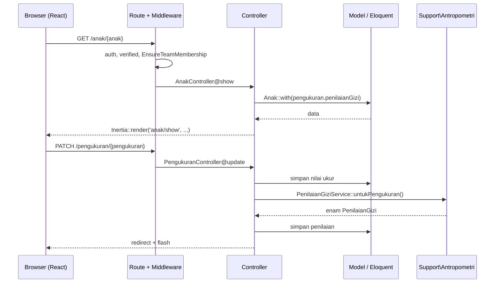
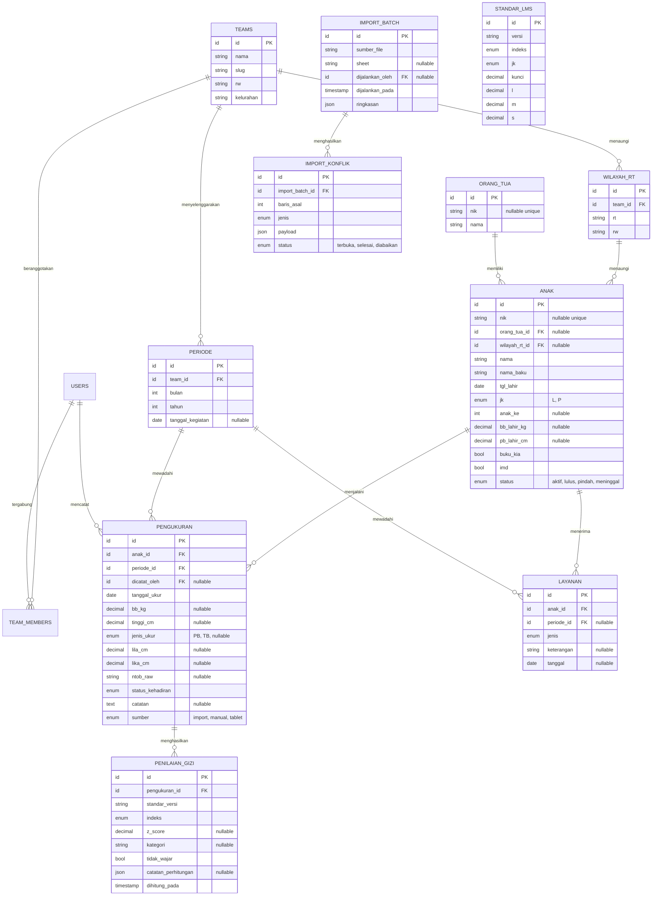

# Software Design Document — Portal Posyandu Tulip

Dokumen ini mengunci arsitektur, data model, dan otorisasi. Perubahan pada bagian mana pun di sini menuntut *pull request* tersendiri, bukan diputuskan saat implementasi berlangsung.

---

## 1. Arsitektur

### 1.1 Tumpukan teknologi

| Lapisan | Teknologi |
|---|---|
| Bahasa & framework | PHP 8.3, Laravel 13 |
| Autentikasi | Laravel Fortify (2FA, Passkeys) |
| Basis data | SQLite (default), kompatibel MySQL/PostgreSQL |
| Jembatan *fullstack* | Inertia.js v3 |
| UI | React 19 + TypeScript 5.7 |
| Build | Vite 8 + React Compiler |
| Styling | Tailwind CSS v4 |
| Komponen | shadcn/ui di atas Radix UI |
| Ikon & notifikasi | Lucide React, Sonner |
| *Route helper* | Laravel Wayfinder |
| Test | Pest PHP 5 |
| Lint & format | Pint, Larastan, ESLint 9, Prettier |

### 1.2 Prinsip

**Tidak ada REST API atau GraphQL.** Inertia menghubungkan *controller* Laravel langsung ke komponen React. *Controller* mengembalikan `Inertia::render()`; form mengirim POST/PATCH/DELETE biasa dan menerima *redirect*. Membangun REST API di samping Inertia berarti memelihara dua kontrak untuk satu kebutuhan.

Satu-satunya pengecualian yang mungkin muncul kelak adalah *endpoint* sinkronisasi dari Aplikasi Tablet — dan itu masih terbuka ([ADR-0003](adr/0003-batas-portal-vs-aplikasi-tablet.md)).

**Perhitungan status gizi hanya ada di backend.** Tabel standar tidak pernah dikirim ke browser.

**Tidak ada abstraksi tanpa pemakai kedua.** Tidak ada *repository interface* dengan satu implementasi, tidak ada *service layer* untuk *controller* yang hanya memanggil satu model.

### 1.3 Alur permintaan



### 1.4 Struktur folder

```text
app/
  Console/Commands/ImportArsipPosyandu.php
  Enums/            Indeks, JenisKelamin, JenisUkur, StatusKehadiran,
                    StatusAnak, JenisLayanan, TeamRole*, TeamPermission*
  Http/Controllers/ AnakController, OrangTuaController, WilayahRtController,
                    PengukuranController, PeriodeController, LaporanController,
                    DashboardController*
  Http/Requests/    satu FormRequest per aksi tulis
  Models/           Anak, OrangTua, WilayahRt, Periode, Pengukuran,
                    PenilaianGizi, StandarLms, Layanan, ImportBatch,
                    ImportKonflik, Team*, Membership*, User*
  Policies/         AnakPolicy, PengukuranPolicy, PeriodePolicy, TeamPolicy*
  Support/Antropometri/  Indeks, ZScore, Kategori, StandarLmsRepository,
                         PenilaianGiziService
database/
  data/who-lms.json      seed standar, di-commit
  migrations/            2026_09_*_create_*
  seeders/               PosyanduSeeder, StandarLmsSeeder
resources/js/
  pages/anak/{index,create,edit,show}.tsx
  pages/periode/index.tsx
  pages/laporan/rekap.tsx
  pages/dashboard.tsx*
  components/kms-chart.tsx
  components/status-gizi-badge.tsx
docs/
```

`*` = sudah ada dari *starter kit*, diubah atau dipakai ulang.

---

## 2. Data model

### 2.1 ERD



### 2.2 Data dictionary

Hanya kolom yang menuntut penjelasan. Kolom `id`, `created_at`, dan `updated_at` mengikuti konvensi Laravel dan tidak diulang di sini.

#### `wilayah_rt`

| Kolom | Tipe | Aturan |
|---|---|---|
| `team_id` | FK → `teams` | Selalu Posyandu Tulip untuk saat ini. Lihat [ADR-0004](adr/0004-reuse-team-sebagai-rbac.md). |
| `rt` | `string(3)` | String, bukan integer — menjaga bentuk `01`. |
| `rw` | `string(3)` | Selalu `18` untuk saat ini. |

*Unique:* `(team_id, rt, rw)`

#### `orang_tua`

| Kolom | Tipe | Aturan |
|---|---|---|
| `nik` | `string(16)` `nullable` | *Unique*, boleh `NULL` (DR-02). |
| `nama` | `string` | Data sumber memuat bentuk `AYAH - IBU` dalam satu sel. Disimpan apa adanya; pemisahan menjadi dua entitas ditunda sampai ada kebutuhan nyata. |

#### `anak`

| Kolom | Tipe | Aturan |
|---|---|---|
| `nik` | `string(16)` `nullable` | *Unique*, boleh `NULL` (DR-01, DR-02). |
| `nama` | `string` | Nama sebagaimana tertulis di sumber. |
| `nama_baku` | `string` | Nama yang sudah dibakukan, dipakai untuk pencarian dan pencocokan. Berasal dari kolom `NAMA_BAKU` arsip; bila kosong, diisi dari `nama`. |
| `tgl_lahir` | `date` | Wajib. Tanpa ini status gizi tidak dapat dihitung. |
| `jk` | `enum('L','P')` | Wajib. |
| `bb_lahir_kg` | `decimal(5,2)` `nullable` | **Kilogram.** Nilai sumber bersatuan gram (mis. `2986`) menjadi konflik impor, bukan dikonversi diam-diam. |
| `buku_kia`, `imd` | `boolean` | Sumber memuat teks `ada`/kosong; dinormalisasi saat impor. |
| `status` | `enum` | `aktif`, `lulus` (> 60 bulan), `pindah`, `meninggal`. Hanya `aktif` yang masuk hitungan sasaran (S). |

*Unique:* `nik` (mengizinkan banyak `NULL`)
*Index:* `nama_baku`, `wilayah_rt_id`, `tgl_lahir`

#### `periode`

| Kolom | Tipe | Aturan |
|---|---|---|
| `bulan` | `tinyint` | 1–12. |
| `tahun` | `smallint` | |
| `tanggal_kegiatan` | `date` `nullable` | Tanggal penimbangan. Boleh kosong untuk periode hasil impor arsip. |

*Unique:* `(team_id, bulan, tahun)`

#### `pengukuran`

| Kolom | Tipe | Aturan |
|---|---|---|
| `tanggal_ukur` | `date` | Wajib. Bersama `anak.tgl_lahir` menentukan umur (DR-03). |
| `bb_kg` | `decimal(5,2)` `nullable` | Kosong berbeda dari nol (DR-04). |
| `tinggi_cm` | `decimal(5,1)` `nullable` | Nilai ukur asli, sebelum konversi PB↔TB. |
| `jenis_ukur` | `enum('PB','TB')` `nullable` | DR-05. `NULL` berarti tidak diketahui; perhitungan mengasumsikan dari umur dan mencatat asumsinya. |
| `ntob_raw` | `string(8)` `nullable` | Nilai mentah dari sumber, sudah di-*trim*. **Tidak ada logika turunan** sampai definisinya dikonfirmasi (DR-08). |
| `status_kehadiran` | `enum` | `hadir`, `tidak_hadir`, `pindah`, `tidak_dapat_diukur`. Menampung teks seperti `PINDAH RUMAH` yang di sumber menempati kolom berat (DR-04). |
| `sumber` | `enum` | `import`, `manual`, `tablet`. Membuat asal setiap rekam dapat ditelusuri dan membuat pengiriman ulang bersifat *idempotent*. |

*Unique:* `(anak_id, periode_id)` — DR-10
*Index:* `periode_id`, `tanggal_ukur`

#### `penilaian_gizi`

| Kolom | Tipe | Aturan |
|---|---|---|
| `standar_versi` | `string(20)` | Mis. `WHO-2006`. DR-06. |
| `indeks` | `enum` | `BB_U`, `TB_U`, `BB_TB`, `IMT_U`, `LILA_U`, `LIKA_U`. |
| `z_score` | `decimal(6,3)` `nullable` | `NULL` bila prasyarat tidak lengkap (DR-07). |
| `kategori` | `string(40)` `nullable` | Label PMK 2/2020. `NULL` untuk `LILA_U` sampai OI-04 selesai. |
| `tidak_wajar` | `boolean` | Nilai di luar rentang biologis WHO. Ditandai, bukan dibuang. |
| `catatan_perhitungan` | `json` `nullable` | Mis. `{"jenis_ukur":"diasumsikan dari umur"}`. Membuat asumsi terlihat, bukan tersembunyi. |

*Unique:* `(pengukuran_id, indeks, standar_versi)`

#### `standar_lms`

| Kolom | Tipe | Aturan |
|---|---|---|
| `versi` | `string(20)` | `WHO-2006`. Versi baru ditambahkan, tidak menimpa. |
| `kunci` | `decimal(5,1)` | Umur dalam bulan (indeks `*_U`) atau panjang/tinggi cm (`BB_TB`). |
| `l`, `m`, `s` | `decimal(10,6)` | Disimpan **per baris**, bukan per tabel — lihat temuan OI-05 di [04-spesifikasi-antropometri.md](04-spesifikasi-antropometri.md). |

*Unique:* `(versi, indeks, jk, kunci)`
Isi awal: 906 baris.

#### `layanan`

Satu tabel untuk imunisasi, Vitamin A, dan obat cacing, dibedakan kolom `jenis`. Tiga tabel terpisah tidak menyediakan apa pun yang tidak disediakan satu kolom enum, sementara ketiganya sama-sama berupa "anak menerima sesuatu pada suatu periode".

| Kolom | Tipe | Aturan |
|---|---|---|
| `jenis` | `enum` | `imunisasi`, `vitamin_a`, `obat_cacing`. |
| `keterangan` | `string` `nullable` | Nama antigen atau dosis. |
| `periode_id` | FK `nullable` | Boleh kosong untuk layanan di luar jadwal Posyandu. |

#### `import_batch`, `import_konflik`

Jejak audit impor (DR-09). `import_konflik.jenis`: `nik_ganda`, `tgl_lahir_bentrok`, `nama_mirip`, `satuan_meragukan`, `nilai_bukan_angka`, `anak_tidak_dikenal`.

### 2.3 Enum

Seluruh enum berupa PHP *backed enum* di `app/Enums/`, bukan `string` bebas. Nilainya tersimpan sebagai `string` di basis data agar terbaca saat inspeksi manual.

---

## 3. Route

Seluruh route berada di bawah `middleware(['auth','verified'])`. *Prefix* `{current_team}` dihapus ([ADR-0004](adr/0004-reuse-team-sebagai-rbac.md)).

| Method | URI | Aksi | Peran minimum |
|---|---|---|---|
| GET | `/dashboard` | `DashboardController` | Kader |
| GET | `/anak` | `AnakController@index` | Kader |
| GET | `/anak/create` | `AnakController@create` | Bidan |
| POST | `/anak` | `AnakController@store` | Bidan |
| GET | `/anak/{anak}` | `AnakController@show` | Kader |
| GET | `/anak/{anak}/edit` | `AnakController@edit` | Bidan |
| PATCH | `/anak/{anak}` | `AnakController@update` | Bidan |
| DELETE | `/anak/{anak}` | `AnakController@destroy` | Admin |
| POST | `/anak/{anak}/gabung` | `AnakController@merge` | Bidan |
| GET/POST/PATCH/DELETE | `/orang-tua...` | `OrangTuaController` | Bidan |
| GET/POST/PATCH/DELETE | `/wilayah-rt...` | `WilayahRtController` | Admin |
| POST | `/anak/{anak}/pengukuran` | `PengukuranController@store` | Bidan |
| PATCH | `/pengukuran/{pengukuran}` | `PengukuranController@update` | Bidan |
| DELETE | `/pengukuran/{pengukuran}` | `PengukuranController@destroy` | Admin |
| GET | `/periode` | `PeriodeController@index` | Kader |
| POST | `/periode` | `PeriodeController@store` | Admin |
| PATCH | `/periode/{periode}` | `PeriodeController@update` | Admin |
| GET | `/laporan/rekap` | `LaporanController@rekap` | Kader |
| GET | `/laporan/rekap/export` | `LaporanController@export` | Bidan |

Route bawaan *starter kit* (`/settings/*`, autentikasi Fortify, `/settings/teams/*`) tetap seperti aslinya.

---

## 4. Otorisasi

Tiga peran, diurutkan menaik. Peran yang lebih tinggi mewarisi seluruh hak peran di bawahnya.

| Aksi | Kader | Bidan | Admin |
|---|:---:|:---:|:---:|
| Lihat dashboard | ✅ | ✅ | ✅ |
| Cari & lihat data anak | ✅ | ✅ | ✅ |
| Lihat profil anak & kurva KMS | ✅ | ✅ | ✅ |
| Lihat rekap | ✅ | ✅ | ✅ |
| Tambah & ubah data anak | ❌ | ✅ | ✅ |
| Ubah nilai pengukuran | ❌ | ✅ | ✅ |
| Gabungkan profil duplikat | ❌ | ✅ | ✅ |
| Selesaikan konflik impor | ❌ | ✅ | ✅ |
| Unduh *export* rekap | ❌ | ✅ | ✅ |
| Kelola wilayah RT | ❌ | ❌ | ✅ |
| Kelola periode | ❌ | ❌ | ✅ |
| Hapus anak atau pengukuran | ❌ | ❌ | ✅ |
| Kelola akun & peran | ❌ | ❌ | ✅ |
| Jalankan impor arsip | ❌ | ❌ | ✅ |

Penegakan berlapis:

1. **Policy** (`AnakPolicy`, `PengukuranPolicy`, `PeriodePolicy`) sebagai sumber kebenaran, dipanggil lewat `authorize()` di *controller*.
2. **Middleware** `EnsureTeamMembership:<role>` sebagai penjaga di tingkat route.
3. **UI** menyembunyikan tombol yang tidak boleh dipakai — sebagai kenyamanan, **bukan** sebagai pengamanan.

Setiap baris pada matriks di atas memiliki *test* yang memastikan peran di bawahnya menerima 403.

---

## 5. Frontend

### 5.1 Halaman

| Route | Komponen | Isi |
|---|---|---|
| `/dashboard` | `pages/dashboard.tsx` | Kartu ringkasan D/S, sebaran status gizi, tren stunting, daftar tindak lanjut |
| `/anak` | `pages/anak/index.tsx` | Tabel anak, pencarian, filter RT & status |
| `/anak/{id}` | `pages/anak/show.tsx` | Identitas, kurva KMS, tabel riwayat + z-score, layanan |
| `/anak/create`, `/edit` | `pages/anak/{create,edit}.tsx` | Form profil |
| `/periode` | `pages/periode/index.tsx` | Daftar & pengelolaan periode |
| `/laporan/rekap` | `pages/laporan/rekap.tsx` | Rekap dengan filter dan tombol *export* |

### 5.2 Komponen baru

| Komponen | Alasan |
|---|---|
| `components/kms-chart.tsx` | Kurva pertumbuhan: garis SD sebagai latar, titik pengukuran anak di atasnya. **SVG langsung, tanpa library chart** — bentuk yang dibutuhkan hanya beberapa *path* dan titik, sementara membuat library chart menggambar overlay SD menuntut kustomisasi yang lebih panjang daripada SVG-nya sendiri. |
| `components/status-gizi-badge.tsx` | Label kategori berwarna konsisten di seluruh halaman. |
| `components/ui/table.tsx` | Komponen tabel shadcn; belum ada di repo. |

Seluruh komponen `resources/js/components/ui/**` lain dipakai apa adanya.

### 5.3 Konvensi

- *Route helper* memakai Wayfinder (`import { show } from '@/routes/anak'`), bukan string URL.
- Form memakai `useForm` dari Inertia. Pesan kesalahan datang dari validasi Laravel, dalam bahasa Indonesia.
- Notifikasi memakai Sonner lewat `use-flash-toast` yang sudah ada.
- Tipe data dari *backend* dideklarasikan di `resources/js/types/posyandu.ts`.

---

## 6. Kinerja

| Titik | Risiko | Penanganan |
|---|---|---|
| Daftar anak | Ratusan baris | *Pagination* Laravel; indeks pada `nama_baku` dan `wilayah_rt_id`. |
| Rekap periode | Ribuan pengukuran × 6 penilaian | *Eager loading* `pengukuran.penilaianGizi`; satu *query* per halaman, bukan N+1. |
| Perhitungan massal | 906 baris standar dicari ribuan kali | Seluruh tabel standar dimuat sekali ke memori per proses. |
| *Export* | Seluruh periode sekaligus | *Streamed response* dengan `LazyCollection`, bukan menyusun seluruh larik di memori. |

Angka yang dihadapi (ratusan anak, ribuan pengukuran) tidak menuntut *cache* lintas-permintaan, *queue*, atau denormalisasi. Tidak ada satu pun dari itu yang dibangun sekarang.
