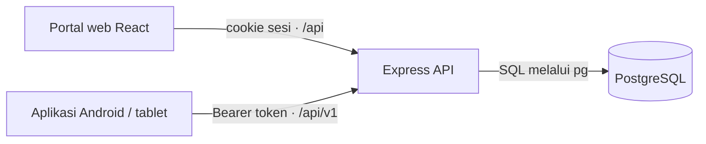

# Kontrak REST API - SIMPATIK Posyandu Tulip

| | |
|---|---|
| **Jenis** | Rujukan |
| **Status** | draf |
| **Perubahan berarti terakhir** | 9 Oktober 2026 |

Dokumen ini menyatukan kontrak API rinci dan versi ringkas yang diberikan tim.
Ia mendefinisikan **target** komunikasi antara Portal web, aplikasi tablet, dan
Express API. Daftar route di sini bukan pernyataan bahwa semuanya telah ada di
kode: pada branch `refactor`, route yang telah terpasang baru autentikasi Portal.

Kontrak mengikat bentuk komunikasi client-server. Database yang berada di
belakang Express adalah PostgreSQL; tempat pemasangannya tidak ditentukan oleh
kontrak ini.

---

## 1. Batas tanggung jawab



Express adalah satu-satunya pintu masuk data aplikasi. Ia menangani
autentikasi, pembatasan peran dan RT, validasi, perhitungan gizi, audit, serta
sinkronisasi tablet. Client tidak mengakses PostgreSQL secara langsung.

| Channel | Pemakai | Route | Autentikasi | Tujuan |
|---|---|---|---|---|
| Portal web | React di browser | `/api` | cookie `sesi` HTTP-only | operasi Portal internal |
| API tablet | Android/WebView | `/api/v1` | `Authorization: Bearer <token>` | kerja lapangan dan sinkronisasi |

Kredensial masuk memakai `username` dan `kataSandi`. Username dibuat lebih
dulu oleh admin; tidak ada pendaftaran akun publik.

---

## 2. Aturan bersama

### 2.1 Body, waktu, dan envelope

- Body memakai JSON dengan batas 4 MB.
- Permintaan yang mengubah data wajib memakai `Content-Type: application/json`.
- Waktu memakai ISO 8601; tanggal tanpa waktu memakai `YYYY-MM-DD`.
- List berpaginasi memakai bentuk berikut:

  ```json
  {
    "items": [],
    "total": 150,
    "halaman": 1,
    "ukuran": 25
  }
  ```

- Respons detail membungkus sumber daya dengan nama yang jelas, misalnya
  `{ "anak": { ... } }` atau `{ "pengguna": { ... } }`.

### 2.2 Error response

Error yang aman ditampilkan ke pengguna selalu berbentuk:

```json
{ "error": "Pesan error berbahasa Indonesia" }
```

| Status | Arti |
|---:|---|
| `400` | body, parameter, atau format data tidak valid |
| `401` | sesi/token tidak ada atau tidak berlaku |
| `403` | peran tidak memiliki izin atau kader melewati RT binaannya |
| `404` | route atau sumber daya tidak ditemukan |
| `415` | body mutasi bukan JSON |
| `429` | terlalu banyak percobaan login; sertakan `Retry-After` |
| `500` | error tak terduga tanpa membocorkan detail internal |

### 2.3 Sesi dan keamanan

| Hal | Ketentuan |
|---|---|
| Token | token acak 256-bit; basis data hanya menyimpan digest SHA-256 |
| Masa berlaku | 12 jam |
| Web | cookie `sesi`, HTTP-only dan `SameSite=Lax` |
| Tablet | header `Authorization: Bearer <token>` |
| Login | maksimum 5 kegagalan per `(username, IP)`, lalu ditahan 15 menit |
| CORS | dibutuhkan untuk `/api/v1/*` bila tablet WebView memakai origin `null` |

---

## 3. Peran dan izin

Peran berjenjang: `bidan` mewarisi seluruh izin `kader`, dan `admin` mewarisi
seluruh izin `bidan`. Kader hanya dapat mengakses data RT binaannya; aturan ini
wajib ditegakkan di server dan query, bukan hanya disembunyikan di antarmuka.

| Aksi | Peran minimum | Kegunaan |
|---|---|---|
| `lihat-dashboard` | kader | melihat beranda periode |
| `lihat-anak` | kader | mencari dan membuka profil anak |
| `lihat-kms` | kader | membaca riwayat ukur/KMS |
| `lihat-rekap` | kader | melihat rekap |
| `daftar-anak-lapangan` | kader | mendaftarkan anak dari tablet |
| `catat-pengukuran-lapangan` | kader | mencatat ukur dari tablet |
| `selesaikan-sesi-lapangan` | kader | menutup sesi kerja lapangan |
| `ubah-anak` | bidan | mengoreksi profil anak |
| `ubah-pengukuran` | bidan | mengoreksi hasil ukur |
| `gabung-duplikat` | bidan | menggabungkan profil ganda |
| `selesaikan-konflik-impor` | bidan | menyelesaikan konflik impor |
| `unduh-rekap` | bidan | mengunduh laporan |
| `kelola-wilayah-rt` | admin | mengelola RT |
| `kelola-periode` | admin | mengelola periode |
| `hapus-data` | admin | menghapus data bila diperlukan |
| `kelola-akun` | admin | membuat, mengubah, atau menonaktifkan akun |
| `jalankan-impor` | admin | menjalankan impor Excel |

---

## 4. Endpoint

### 4.1 Autentikasi Portal web

Route ini dipasang pada `/api`.

| Method | Path | Auth | Keterangan |
|---|---|---|---|
| `POST` | `/api/masuk` | publik | memulai sesi web dan memasang cookie `sesi` |
| `POST` | `/api/keluar` | cookie opsional | mencabut sesi bila ada dan selalu menghapus cookie |
| `GET` | `/api/saya` | cookie atau Bearer | mengembalikan identitas pengguna aktif |

`POST /api/masuk` menerima:

```json
{
  "username": "kader.rt01",
  "kataSandi": "kata-sandi"
}
```

Respons `200` memasang cookie dan mengembalikan pengguna aktif:

```json
{
  "pengguna": {
    "id": 1,
    "nama": "Siti Aminah",
    "username": "kader.rt01",
    "peran": "kader",
    "rt": "001",
    "aktif": true
  }
}
```

`POST /api/keluar` selalu mengembalikan `204 No Content`, termasuk bila sesi
sudah hilang. `GET /api/saya` mengembalikan `401` bila sesi tidak berlaku.

### 4.2 Autentikasi tablet dan health check

Route ini dipasang pada `/api/v1`.

| Method | Path | Auth | Keterangan |
|---|---|---|---|
| `POST` | `/api/v1/masuk` | publik | login tablet dan mengembalikan Bearer token |
| `POST` | `/api/v1/keluar` | Bearer | mencabut token tablet |
| `GET` | `/api/v1/kesehatan` | publik | memeriksa API serta koneksi PostgreSQL |

Login tablet menerima body yang sama seperti login web, tetapi mengembalikan:

```json
{
  "token": "base64url-string",
  "kedaluwarsa": "2026-10-05T07:37:00.000Z",
  "pengguna": { "id": 1, "peran": "kader", "rt": "001", "aktif": true }
}
```

Health check yang sehat menjawab `200` dengan `status`, `database`, dan
`waktuServer`; kegagalan koneksi basis data menjawab `500`.

### 4.3 Data anak dan pengukuran

Semua route berikut memerlukan sesi yang sah. Hasilnya dibatasi berdasarkan RT
untuk kader.

| Method | Path | Izin minimum | Keterangan |
|---|---|---|---|
| `GET` | `/api/v1/anak` | `lihat-anak` | daftar anak berpaginasi dan dapat dicari |
| `GET` | `/api/v1/anak/:id` | `lihat-anak` | profil lengkap satu anak |
| `GET` | `/api/v1/anak/:id/pengukuran` | `lihat-kms` | riwayat pengukuran untuk KMS |
| `POST` | `/api/v1/anak` | `daftar-anak-lapangan` | mendaftarkan atau memperbarui anak berdasarkan NIK |
| `POST` | `/api/v1/pengukuran` | `catat-pengukuran-lapangan` | menyimpan ukur dan menghitung gizi di server |

`GET /api/v1/anak` mendukung parameter berikut:

| Parameter | Default | Keterangan |
|---|---:|---|
| `cari` | - | kata kunci pencarian |
| `halaman` | `1` | nomor halaman positif |
| `ukuran` | `25` | jumlah item per halaman |

Daftar menggunakan envelope paginasi pada [bagian 2.1](#21-body-waktu-dan-envelope).
Endpoint detail mengembalikan `404` bila anak tidak ada atau tidak dapat
diakses. Mutasi anak dan pengukuran mengembalikan `201` dengan envelope
`anak` atau `pengukuran`.

### 4.4 Sinkronisasi offline tablet

| Method | Path | Izin minimum | Keterangan |
|---|---|---|---|
| `GET` | `/api/v1/sinkronisasi` | `lihat-anak` | paket sasaran dan riwayat ukur untuk cache tablet |

Endpoint ini adalah sync download awal. Upload dasar saat perangkat online
berjalan melalui `POST /api/v1/anak` dan `POST /api/v1/pengukuran`.

### 4.5 Dashboard dan periode

| Method | Path | Izin minimum | Keterangan |
|---|---|---|---|
| `GET` | `/api/v1/periode` | `lihat-dashboard` | daftar periode tersedia |
| `GET` | `/api/v1/beranda` | `lihat-dashboard` | statistik dashboard per periode |

`GET /api/v1/beranda` wajib menerima `periode=YYYY-MM`. Format salah menjawab
`400`, sedangkan periode yang tidak tersedia menjawab `404`.

### 4.6 Pengelolaan pengguna

Route ini dipasang pada `/api` dan hanya dapat dipakai admin.

| Method | Path | Izin minimum | Keterangan |
|---|---|---|---|
| `GET` | `/api/pengguna` | `kelola-akun` | daftar akun dan pilihan RT binaan |
| `POST` | `/api/pengguna` | `kelola-akun` | membuat akun dengan username dan kata sandi awal |
| `PATCH` | `/api/pengguna/:id` | `kelola-akun` | mengubah profil, peran, RT, status, atau kata sandi |

Tidak ada `DELETE` akun. Akun dinonaktifkan agar sesi dapat dicabut dan jejak
audit tetap utuh. Kata sandi kosong pada `PATCH` berarti kata sandi tidak diubah.

### 4.7 Sasaran, impor Excel, dan sesi lapangan

| Method | Path | Izin minimum | Keterangan |
|---|---|---|---|
| `GET` | `/api/v1/sasaran` | `lihat-anak` | daftar sasaran, dapat difilter `periode` |
| `POST` | `/api/v1/sasaran/pratinjau` | `jalankan-impor` | validasi data Excel tanpa menulis produksi |
| `POST` | `/api/v1/sasaran/impor` | `jalankan-impor` | menjalankan impor Excel |
| `POST` | `/api/v1/sasaran/tutup-sesi` | `selesaikan-sesi-lapangan` | menutup sesi kerja lapangan |

### 4.8 Catch-all

Route `/api/*` yang tidak cocok mengembalikan `404`:

```json
{ "error": "Rute tidak ada" }
```

---

## 5. Rincian yang harus dibekukan sebelum implementasi

PDF mendefinisikan daftar endpoint, tetapi beberapa payload masih `{ ... }`.
Hal berikut tidak boleh ditebak di controller:

1. Field wajib/opsional pendaftaran anak, terutama untuk NIK kosong atau
   bertentangan.
2. Field pengukuran, pengenal periode, validasi nilai, dan respons hasil gizi.
3. Bentuk paket sync: data minimum, ukuran batch, cursor, dan masa cache.
4. Sync upload offline: idempotency key, retry, dan konflik edit web vs tablet.
5. Arti request/response `sasaran/tutup-sesi`.
6. Impor Excel: JSON/base64 hanya aman bila ukuran file di bawah batas 4 MB;
   file lebih besar memerlukan upload terautentikasi atau streaming.
7. Route data untuk React: apakah React memakai `/api/v1` dengan cookie atau
   mendapat facade `/api` khusus Portal.

---

## 6. Urutan implementasi

1. Migrasi `username`, akun admin, login cookie/Bearer, serta middleware auth.
2. RBAC dan pembatasan RT di repository/query.
3. Health check, periode, daftar/detail anak, dan riwayat pengukuran.
4. Pendaftaran anak serta pengukuran dengan transaksi hitung gizi dan audit.
5. Kontrak dan implementasi sync offline dua arah.
6. Dashboard, pengelolaan akun, sasaran, serta impor Excel.

## 7. Sumber

- `rest_api_contracts_detail.pdf`: versi rinci endpoint, autentikasi, dan
  catatan deployment.
- `rest_api_contracts_grup.pdf`: versi ringkas untuk koordinasi kelompok.
