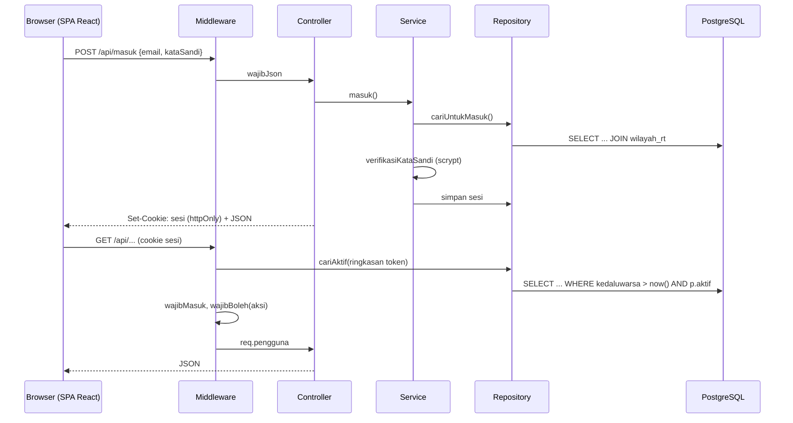

# Arsitektur

| | |
|---|---|
| **Jenis** | Rujukan |
| **Status** | hidup — daftar endpoint menyusul saat dibangun |
| **Perubahan berarti terakhir** | 22 September 2026 |

Bagaimana Portal Posyandu Tulip disusun: teknologinya apa, permintaan mengalir ke mana, berkas ditaruh di mana, dan siapa boleh melakukan apa.

Bentuk tabel dan relasinya ada di [Basis Data](database.md). Alasan di balik keputusan besar ada di [`adr/`](adr).

Dokumen ini dulu `03-sdd.md`, dipecah 22 September 2026. Judul bagiannya deskriptif, bukan bernomor — komentar di kode menyebut namanya (`docs/arsitektur.md — Otorisasi`), sehingga urutannya boleh berubah tanpa memutus rujukan.

---

## Tumpukan teknologi

Ditetapkan [ADR-0006](adr/0006-pindah-ke-express-react-postgres.md). Sebelumnya PHP 8.3 + Laravel 13 + Inertia; seluruh kode PHP sudah dihapus dan riwayatnya tinggal di git.

| Lapisan | Teknologi |
|---|---|
| Arsitektur makro | Decoupled client-server: SPA + REST API |
| Runtime server | Node.js 24, TypeScript dijalankan langsung tanpa langkah build |
| Server HTTP | Express 5 |
| Arsitektur mikro server | Controller - Service - Repository |
| Basis data | PostgreSQL 17 (Docker saat pengembangan) |
| Akses basis data | `pg`, SQL ditulis tangan — tanpa ORM |
| Autentikasi | dibangun sendiri: scrypt (`node:crypto`) + sesi di basis data |
| UI | React 19 + TypeScript 5.9 |
| Build UI | Vite 8 |
| Styling | Tailwind CSS v4 |
| Komponen | shadcn/ui di atas Radix UI |
| Ikon | Lucide React |
| Uji | `node:test` bawaan Node, di `server/` dan `client/` |
| Lint & format | ESLint 9, Prettier |

Dua dependensi runtime di seluruh server: `express` dan `pg`.

## Prinsip

**Client dan server terpisah, dihubungkan REST.** Server tidak pernah merender HTML aplikasi; ia menjawab JSON. Saat produksi keduanya disajikan dari **satu origin** — Express menyajikan hasil build client sekaligus API-nya — sehingga tidak ada CORS dan tidak ada cookie lintas situs. Pengembangan meniru bentuk itu lewat proxy Vite `/api`, bukan `cors`.

**Apa pun yang hasilnya mengikat dihitung di server.** Status gizi, status pertumbuhan, angka rekap, dan validasi yang menentukan boleh-tidaknya tersimpan adalah milik server. Client boleh menghitung salinannya untuk pratinjau seketika — dan bila itu dilakukan, salinannya **wajib diikat ke acuan yang sama**. Satu-satunya salinan yang ada sekarang adalah z-score di editor baris, diikat `client/test/z-score.test.ts` ke 2.076 kasus milik server.

**Otorisasi ditegakkan server, bukan antarmuka.** Menyembunyikan menu hanya membuat antarmuka jujur; yang mengikat adalah `wajibBoleh()`.

**Tidak ada abstraksi tanpa pemakai kedua.** Tidak ada antarmuka repository dengan satu implementasi, tidak ada lapisan service untuk controller yang hanya memanggil satu query.

**Tanpa dependensi yang dapat digantikan beberapa baris.** Pengurai cookie, pembatas percobaan masuk, dan pelari migrasi ditulis sendiri karena masing-masing muat dalam belasan baris.

## Alur permintaan



Pemeriksaan `p.aktif` dilakukan di SQL pada setiap permintaan, tanpa cache. Dengan begitu menonaktifkan akun langsung mematikan sesi yang sedang berjalan.

## Struktur folder

```text
server/
  src/antropometri/   indeks, tabel-standar, z-score, kategori,
                      penilaian-gizi, sumber-standar
  src/auth/           peran (matriks izin), kata-sandi (scrypt), sesi
  src/http/           server, middleware, auth-controller,
                      cookie, batas-masuk, tipe.d.ts
  src/repositories/   standar-lms, pengguna, sesi, penilaian-gizi, audit
  src/services/       auth-service, gizi-service
  src/db/pool.ts, src/db/transaksi.ts
  db/migrations/      001_skema_awal.sql, 002_pengguna_dan_sesi.sql,
                      004_audit.sql,
                      003_updated_at_dan_nik_terhapus.sql
  db/data/who-lms.json        seed standar, di-commit
  db/migrate.ts, db/seed-standar-lms.ts,
                      db/buat-pengguna.ts, db/ganti-sandi.ts
  test/               acuan-php.json + berkas *.test.ts
  docker-compose.yml
client/
  index.html                  entri aplikasi
  src/main.tsx, src/app.tsx   entri dan cangkang aplikasi
  src/app-shell.tsx           router, penjaga rute, sidebar
  src/layar.tsx               pemasok props — titik ganti saat endpoint datang
  src/pages/                  dashboard, anak/{index,show}, laporan,
                              pengaturan, auth/login
  src/components/             kms-chart, status-gizi-badge, halaman, ui/table, …
  src/lib/                    nav, sesi, format, z-score, kategori, utils
  src/data/contoh/            data contoh — sementara, sampai endpoint ada
  src/assets/fonts/
  test/
  demo/                       entri demo statis, tanpa backend
docs/
```

Aplikasi dan demo berbagi seluruh `src/`; yang berbeda hanya entri, cara masuk, dan pemilih peran.

---

## Otorisasi

Tiga peran, diurutkan menaik. Peran yang lebih tinggi mewarisi seluruh hak peran di bawahnya.

| Aksi | Kader | Bidan | Admin |
|---|:---:|:---:|:---:|
| Lihat dashboard | ✅ | ✅ | ✅ |
| Cari & lihat data anak | ✅ | ✅ | ✅ |
| Lihat profil anak & kurva KMS | ✅ | ✅ | ✅ |
| Lihat rekap | ✅ | ✅ | ✅ |
| Tambah & ubah data anak | ❌ | ✅ | ✅ |
| Ubah nilai pengukuran | ❌ | ✅ | ✅ |
| Gabungkan profil duplikat | ❌ | ✅ | ✅ |
| Selesaikan konflik impor | ❌ | ✅ | ✅ |
| Unduh *export* rekap | ❌ | ✅ | ✅ |
| Kelola wilayah RT | ❌ | ❌ | ✅ |
| Kelola periode | ❌ | ❌ | ✅ |
| Hapus anak atau pengukuran | ❌ | ❌ | ✅ |
| Kelola akun & peran | ❌ | ❌ | ✅ |
| Jalankan impor arsip | ❌ | ❌ | ✅ |

Matriks ini **ditulis sekali** di [`server/src/auth/peran.ts`](../server/src/auth/peran.ts) dan tidak disalin ke mana pun. Tiap aksi menyebut peran terendah yang boleh melakukannya, bukan daftar peran — daftar yang ditulis tangan cepat atau lambat punya satu baris yang lupa diperbarui.

Penegakan berlapis:

1. **`boleh(peran, aksi)`** sebagai sumber kebenaran.
2. **`wajibBoleh(aksi)`** sebagai middleware per rute. Ini yang mengikat: ia yang menjawab 403.
3. **Antarmuka** menyembunyikan menu yang tidak boleh dipakai — kenyamanan, **bukan** pengamanan.

Ke-14 aksi × 3 peran diuji satu per satu di `server/test/auth.test.ts`, ditambah invarian bahwa peran lebih tinggi tidak pernah kehilangan hak peran di bawahnya. Tabel harapan di berkas uji ditulis ulang dari dokumen ini, **tidak** diimpor dari kode yang diujinya.

### Pembatasan RT kader

Kader hanya boleh menyentuh data RT binaannya. `rtYangBolehDilihat()` mengembalikan `null` untuk bidan dan admin, yang berarti seluruh RW. Untuk kader tanpa RT binaan ia **melempar galat**, bukan mengembalikan `null` — sebab `null` di sini berarti akses penuh, dan kader tanpa RT seharusnya tidak punya akses sama sekali.

Skema ikut menegakkannya lewat `CHECK ((peran = 'kader') = (wilayah_rt_id IS NOT NULL))`, sehingga keadaan itu tidak dapat tersimpan sejak awal.

---

## Endpoint

> **Menunggu endpoint data.** Tabel route lama memetakan `*Controller@aksi` Laravel beserta middleware-nya. Seluruhnya hilang bersama Laravel, dan penggantinya belum ada kecuali autentikasi. Bagian ini diisi saat endpoint kelima layar dibangun — mengarangnya sekarang berarti menulis dua kali.

Yang sudah ada:

| Method | URI | Aksi | Peran minimum |
|---|---|---|---|
| POST | `/api/masuk` | masuk, memasang cookie sesi | — (terbuka) |
| POST | `/api/keluar` | mencabut sesi | — (terbuka) |
| GET | `/api/saya` | identitas pengguna yang sedang masuk | sudah masuk |

Seluruh rute berada di bawah `sesiMiddleware`, yang mengenali sesi tanpa menolak. Penolakan adalah tugas `wajibMasuk` dan `wajibBoleh(aksi)`, dipasang per rute. Permintaan yang mengubah data wajib berbadan `application/json` (`wajibJson`, 415 bila bukan) — berpasangan dengan `SameSite=Lax` untuk menutup CSRF tanpa token tersendiri.

---

## Frontend

### Halaman

| Route | Komponen | Isi |
|---|---|---|
| `/dashboard` | `pages/dashboard.tsx` | Kartu ringkasan D/S, sebaran status gizi, tren stunting, daftar tindak lanjut |
| `/anak` | `pages/anak/index.tsx` | Tabel anak, pencarian, filter RT & status |
| `/anak/{id}` | `pages/anak/show.tsx` | Identitas, kurva KMS, tabel riwayat + z-score, layanan |
| `/laporan` | `pages/laporan/index.tsx` | Rekap SKDN per RT, tab rentang waktu, tren enam bulan |
| `/pengaturan` | `pages/pengaturan/index.tsx` | Ambang kewajaran, tabel standar, kelola pengguna |
| — | `pages/auth/login.tsx` | Layar Masuk |

Tiga halaman yang pernah dirancang **belum ada**: form profil anak tersendiri (`anak/create`, `anak/edit`) — penggantinya editor baris di dalam Data Balita — dan halaman Periode. Alamatnya memakai hash (`#/balita/12`), bukan path.

### Komponen baru

| Komponen | Alasan |
|---|---|
| `components/kms-chart.tsx` | Kurva pertumbuhan: garis SD sebagai latar, titik pengukuran anak di atasnya. **SVG langsung, tanpa library chart** — bentuk yang dibutuhkan hanya beberapa *path* dan titik, sementara membuat library chart menggambar overlay SD menuntut kustomisasi yang lebih panjang daripada SVG-nya sendiri. |
| `components/status-gizi-badge.tsx` | Label kategori berwarna konsisten di seluruh halaman. |
| `components/ui/table.tsx` | Komponen tabel shadcn. Sudah ada. |

Primitif shadcn lain diambil dari hulunya saat dibutuhkan; hanya `ui/table.tsx` yang ikut pindah dari repo lama. Ia dipakai **empat** layar bertabel — Data Balita, Detail anak, Laporan, Pengaturan. Daftar komponen selengkapnya di [UI/UX](rujukan/ui-ux.md) bagian 4.

### Konvensi

- Navigasi memakai `Link`, `navigate`, dan `useAlamat` dari `client/src/lib/nav.tsx` — router berbasis alamat hash, tanpa pustaka. Alamat hash dipilih supaya hasil build dapat disajikan static host mana pun tanpa aturan *rewrite*.
- Form adalah form React biasa. Pesan kesalahan datang dari server sebagai JSON `{ galat }`, dalam bahasa Indonesia.
- Sesi dibaca lewat `useSesi()` di `client/src/lib/sesi.ts`; token sesinya cookie `httpOnly` dan tidak pernah terjangkau JavaScript.
- Tipe data dari server dideklarasikan di `client/src/types/posyandu.ts`.
- Props tiap halaman dipasok satu tempat, `client/src/layar.tsx` — itulah yang berubah saat endpoint data datang.

---

## Kinerja

| Titik | Risiko | Penanganan |
|---|---|---|
| Daftar anak | Ratusan baris | Indeks pada `nama_baku` dan `wilayah_rt_id`; paging ditambahkan bila daftarnya tumbuh melewati satu RW. |
| Rekap periode | Ribuan pengukuran × 6 penilaian | Satu `JOIN` yang mengambil pengukuran beserta penilaiannya sekaligus — satu *query* per halaman, bukan N+1. |
| Perhitungan massal | 906 baris standar dicari ribuan kali | Seluruh tabel standar dimuat sekali ke memori per proses. |
| *Export* | Seluruh periode sekaligus | Kursor `pg` yang dialirkan baris demi baris ke respons, bukan menyusun seluruh larik di memori. |

Angka yang dihadapi (ratusan anak, ribuan pengukuran) tidak menuntut *cache* lintas-permintaan, *queue*, atau denormalisasi. Tidak ada satu pun dari itu yang dibangun sekarang.
