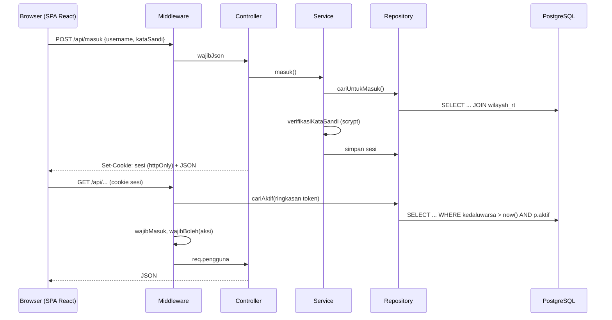

# Arsitektur

| | |
|---|---|
| **Jenis** | Rujukan |
| **Status** | hidup — daftar endpoint menyusul saat dibangun |
| **Perubahan berarti terakhir** | 29 September 2026 |

Bagaimana SIMPATIK Posyandu disusun: teknologinya apa, permintaan mengalir ke mana, berkas ditaruh di mana, dan siapa boleh melakukan apa.

Bentuk tabel dan relasinya ada di [Basis Data](database.md). Alasan di balik keputusan besar ada di [`adr/`](adr).

Judul bagiannya deskriptif, bukan bernomor. Komentar di kode menyebut namanya (`docs/arsitektur.md — Otorisasi`), sehingga urutannya boleh berubah tanpa memutus rujukan.

---

## Tumpukan teknologi

Ditetapkan [ADR-0006](adr/0006-pindah-ke-express-react-postgres.md).

| Lapisan | Teknologi |
|---|---|
| Arsitektur makro | Decoupled client-server: SPA + REST API |
| Runtime server | Node.js 24, TypeScript dijalankan langsung tanpa langkah build |
| Server HTTP | Express 5 |
| Arsitektur mikro server | Controller - Service - Repository |
| Basis data | PostgreSQL 17 (Docker saat pengembangan) |
| Akses basis data | `pg`, SQL ditulis tangan — tanpa ORM |
| Autentikasi | dibangun sendiri: scrypt (`node:crypto`) + sesi di basis data |
| UI | React 19 + TypeScript 5.9 |
| Build UI | Vite 8 |
| Styling | Tailwind CSS v4 |
| Komponen | Ditulis sendiri di `client/src/components/`; hanya tabel yang diambil dari shadcn/ui. Dialog memakai `<dialog>` bawaan peramban, tanpa Radix |
| Ikon | Lucide React |
| Uji | `node:test` bawaan Node, di `server/` dan `client/` |
| Lint & format | ESLint 9, Prettier |

Dua dependensi runtime di seluruh server: `express` dan `pg`. Di client tujuh: `react`, `react-dom`, `lucide-react`, `clsx`, `tailwind-merge`, `qrcode.react` untuk QR kartu, dan `@zxing/browser` untuk kamera pemindai. Yang terakhir baru diunduh saat kamera dibuka.

## Prinsip

**Client dan server terpisah, dihubungkan REST.** Server tidak pernah merender HTML aplikasi; ia menjawab JSON. Saat produksi keduanya disajikan dari **satu origin** — Express menyajikan hasil build client sekaligus API-nya — sehingga tidak ada CORS dan tidak ada cookie lintas situs. Pengembangan meniru bentuk itu lewat proxy Vite `/api`, bukan `cors`.

**Apa pun yang hasilnya mengikat dihitung di server.** Status gizi, status pertumbuhan, angka rekap, dan validasi yang menentukan boleh-tidaknya tersimpan adalah milik server. Client boleh menghitung salinannya untuk pratinjau seketika — dan bila itu dilakukan, salinannya **wajib diikat ke acuan yang sama**. Satu-satunya salinan yang ada sekarang adalah z-score di editor baris, diikat `client/test/z-score.test.ts` ke 2.076 kasus milik server.

**Otorisasi ditegakkan server, bukan antarmuka.** Menyembunyikan menu hanya membuat antarmuka jujur; yang mengikat adalah `wajibBoleh()`.

**Tidak ada abstraksi tanpa pemakai kedua.** Tidak ada antarmuka repository dengan satu implementasi, tidak ada lapisan service untuk controller yang hanya memanggil satu query.

**Tanpa dependensi yang dapat digantikan beberapa baris.** Pengurai cookie, pembatas percobaan masuk, dan pelari migrasi ditulis sendiri karena masing-masing muat dalam belasan baris.

## Alur permintaan


```mermaid
sequenceDiagram
    participant B as Browser (SPA React)
    participant M as Middleware
    participant C as Controller
    participant S as Service
    participant R as Repository
    participant D as PostgreSQL

    B->>M: POST /api/masuk {username, kataSandi}
    M->>C: wajibJson
    C->>S: masuk()
    S->>R: cariUntukMasuk()
    R->>D: SELECT ... JOIN wilayah_rt
    S->>S: verifikasiKataSandi (scrypt)
    S->>R: simpan sesi
    C-->>B: Set-Cookie: sesi (httpOnly) + JSON

    B->>M: GET /api/... (cookie sesi)
    M->>R: cariAktif(ringkasan token)
    R->>D: SELECT ... WHERE kedaluwarsa > now() AND p.aktif
    M->>M: wajibMasuk, wajibBoleh(aksi)
    M->>C: req.pengguna
    C-->>B: JSON
```

Pemeriksaan `p.aktif` dilakukan di SQL pada setiap permintaan, tanpa cache. Dengan begitu menonaktifkan akun langsung mematikan sesi yang sedang berjalan.

## Struktur folder

```text
server/
  src/antropometri/   indeks, tabel-standar, z-score, kategori,
                      penilaian-gizi, sumber-standar
  src/auth/           peran (matriks izin), kata-sandi (scrypt), sesi,
                      akun (aturan isian akun)
  src/http/           server, middleware, auth-controller,
                      pengguna-controller, cookie, batas-masuk, tipe.d.ts
  src/repositories/   standar-lms, pengguna, sesi, penilaian-gizi
  src/services/       auth-service, gizi-service, pengguna-service
  src/db/pool.ts, src/db/transaksi.ts
  db/migrations/      001_skema_awal.sql, 002_pengguna_dan_sesi.sql,
                      003_updated_at_dan_nik_terhapus.sql, 004_audit.sql,
                      005_audit_tanpa_hash_sandi.sql, 006_username.sql
  db/data/who-lms.json        seed standar, di-commit
  db/migrate.ts, db/seed-standar-lms.ts,
                      db/seed-contoh.ts (wilayah dan akun contoh,
                      khusus basis data lokal),
                      db/buat-pengguna.ts, db/ganti-sandi.ts
  test/               acuan-php.json + berkas *.test.ts
  docker-compose.yml
client/
  index.html                  entri aplikasi
  src/main.tsx, src/app.tsx   entri dan cangkang aplikasi
  src/app-shell.tsx           router, penjaga rute, sidebar
  src/layar.tsx               pemasok props — titik ganti saat endpoint datang
  src/pages/                  dashboard, layanan, anak/{index,show,riwayat},
                              kartu-sasaran, laporan, sasaran, pengaturan,
                              auth/login
  src/components/             kms-chart, status-gizi-badge, kartu-balita,
                              dialog, halaman, filter-periode, empty-state,
                              ui/table
  src/lib/                    nav, sesi, pengguna, format, kartu-sasaran,
                              z-score, kategori, utils
  src/data/contoh/            data contoh — sementara, sampai endpoint ada
  src/assets/fonts/
  test/
  demo/                       entri demo statis, tanpa backend
docs/
```

Aplikasi dan demo berbagi seluruh `src/`; yang berbeda hanya entri, cara masuk, dan pemilih peran.

---

## Otorisasi

Tiga peran operasional berjenjang (kader, bidan, admin); Petugas KMS adalah peran khusus yang tidak mewarisi hak kader.

| Aksi | Kader | Bidan | Admin | Petugas KMS |
|---|:---:|:---:|:---:|:---:|
| Lihat dashboard dan antrean layanan | ✅ | ✅ | ✅ | ✅ |
| Cari & lihat data anak, status gizi, dan kurva KMS | ✅ | ✅ | ✅ | ✅ |
| Lihat rekap | ✅ | ✅ | ✅ | ❌ |
| Ubah data profil anak | ✅* | ✅ | ✅ | ❌ |
| Tambah data anak | ✅ | ✅ | ✅ | ❌ |
| Ubah nilai pengukuran | ❌ | ✅ | ✅ | ❌ |
| Gabungkan profil / selesaikan konflik impor | ❌ | ✅ | ✅ | ❌ |
| Unduh *export* rekap | ❌ | ✅ | ✅ | ❌ |
| Kelola wilayah, periode, data, akun, impor | ❌ | ❌ | ✅ | ❌ |
| Tutup sesi sasaran (menandai sasaran tersisa tidak hadir) | ❌ | ❌ | ✅ | ❌ |
| Konfirmasi tahap penjelasan KMS selesai | ❌ | ❌ | ❌ | ✅ |

Matriks ini **ditulis sekali** di [`server/src/auth/peran.ts`](../server/src/auth/peran.ts) dan tidak disalin ke mana pun. Tiap aksi menyebut peran terendah yang boleh melakukannya, bukan daftar peran — daftar yang ditulis tangan cepat atau lambat punya satu baris yang lupa diperbarui.

Penegakan berlapis:

1. **`boleh(peran, aksi)`** sebagai sumber kebenaran.
2. **`wajibBoleh(aksi)`** sebagai middleware per rute. Ini yang mengikat: ia yang menjawab 403.
3. **Antarmuka** menyembunyikan menu yang tidak boleh dipakai — kenyamanan, **bukan** pengamanan.

Ke-18 aksi diuji untuk setiap peran di `server/test/auth.test.ts`, ditambah invarian pewarisan untuk tiga peran operasional. Tabel harapan di berkas uji ditulis ulang dari dokumen ini, **tidak** diimpor dari kode yang diujinya.

### Cakupan RT kader

Semua kader yang masuk melihat seluruh data sasaran lintas RT: daftar master anak, profil dan riwayat, laporan, paket sinkronisasi tablet, serta antrean bersama. RT pada akun tetap dicatat sebagai informasi penugasan; nilai itu tidak membatasi akses. Penutupan sesi sasaran hanya dapat dilakukan admin.

`rtYangBolehDilihat()` mengembalikan `null` untuk semua peran, yang berarti query tidak memasang filter RT. UI Pengaturan menampilkan “Semua RT” sebagai cakupan akses dan menyebut RT kader sebagai RT penugasan.

Skema ikut menegakkannya lewat `CHECK ((peran = 'kader') = (wilayah_rt_id IS NOT NULL))`, sehingga keadaan itu tidak dapat tersimpan sejak awal.

---

## Endpoint

Endpoint operasional mencakup:

| Method | URI | Aksi | Peran minimum |
|---|---|---|---|
| POST | `/api/masuk` | masuk, memasang cookie sesi | — (terbuka) |
| POST | `/api/keluar` | mencabut sesi | — (terbuka) |
| GET | `/api/saya` | identitas pengguna yang sedang masuk | sudah masuk |
| GET | `/api/pengguna` | daftar akun tanpa hash kata sandi, beserta pilihan RT binaan | admin (`kelola-akun`) |
| POST | `/api/pengguna` | akun baru dengan kata sandi awal | admin (`kelola-akun`) |
| PATCH | `/api/pengguna/:id` | ubah akun; kata sandi kosong berarti tidak diganti | admin (`kelola-akun`) |
| GET | `/api/v1/antrean?periodeId=&tanggal=` | antrean layanan pada tanggal itu | kader, bidan, admin, KMS (`lihat-anak`) |
| POST | `/api/v1/antrean` | check-in sasaran ke antrean | kader, bidan, admin (`catat-pengukuran-lapangan`) |
| PATCH | `/api/v1/antrean/:id` | panggil, mulai ukur, atau kirim ke tahap KMS | kader, bidan, admin (`catat-pengukuran-lapangan`) |
| POST | `/api/v1/antrean/:id/konfirmasi-kms` | tandai antrean dan sasaran selesai setelah penjelasan | KMS (`konfirmasi-kms`) |

Status layanan bergerak `waiting → called → serving → kms_review → done`. Hasil pengukuran mengisi tahap ketiga, tetapi tidak melepas satu dari empat slot dan tidak menutup sasaran. Akun Petugas KMS membuka `#/kms`, membaca analisis dari profil anak, lalu mengonfirmasi setelah menjelaskan kepada orang tua. Endpoint konfirmasi memperbarui antrean dan sasaran dalam transaksi yang sama. Penutupan sesi bulanan oleh admin tetap tindakan terpisah.

Seluruh rute berada di bawah `sesiMiddleware`, yang mengenali sesi tanpa menolak. Penolakan adalah tugas `wajibMasuk` dan `wajibBoleh(aksi)`, dipasang per rute. Permintaan yang mengubah data wajib berbadan `application/json` (`wajibJson`, 415 bila bukan) — berpasangan dengan `SameSite=Lax` untuk menutup CSRF tanpa token tersendiri.

Aturan kelola akun ditegakkan di server (`src/auth/akun.ts` dan `src/services/pengguna-service.ts`); layar hanya memeriksanya lebih awal. Tidak ada `DELETE`: akun dinonaktifkan, bukan dihapus. Setiap perubahan berjalan dalam satu transaksi yang menyebut admin pelakunya, sehingga audit mencatatnya dengan sumber `aplikasi`. Mengganti kata sandi, mengubah peran, atau menonaktifkan akun mencabut seluruh sesinya di transaksi yang sama; admin yang hanya mengganti kata sandinya sendiri tetap masuk di sesi yang sedang dipakai. Admin aktif terakhir tidak bisa diturunkan atau dinonaktifkan. Seluruh admin aktif dikunci `FOR UPDATE` lebih dulu, supaya dua admin yang saling menurunkan pada saat bersamaan tidak sama-sama lolos.

---

## Frontend

### Halaman

Alamatnya memakai hash (`#/balita/12`), bukan path. Router dan penjaga rutenya ada di `client/src/app-shell.tsx`; props tiap halaman dipasok `client/src/layar.tsx`. Tangkapan layar tiap halaman ada di [Mulai di sini](mulai-di-sini.md#peta-layar).

| Alamat | Berkas di `client/src/pages/` | Peran | Isi |
|---|---|---|---|
| `#/beranda` | `dashboard.tsx` | semua | Angka S, D, D/S, dan N bulan berjalan; sebaran status gizi; cakupan dan tren enam bulan; daftar Perlu perhatian |
| `#/balita` | `anak/index.tsx` | semua | Data Balita: tabel, pencarian, saringan, tambah dan ubah |
| `#/balita/{id}` | `anak/show.tsx` | semua | Detail Balita: identitas, kurva KMS, status gizi, riwayat singkat, dialog Ubah data dan Cetak kartu |
| `#/balita/{id}/riwayat` | `anak/riwayat.tsx` | semua | Seluruh hasil ukur satu balita beserta z-score |
| `#/kartu-sasaran`, `#/kartu-sasaran/{id}` | `kartu-sasaran/index.tsx` | bidan, admin | Kartu Balita: pilih balita, pratinjau, cetak kartu ber-QR |
| `#/laporan` | `laporan/index.tsx` | semua | Rekap SKDN per RT, bulanan atau enam bulan |
| `#/sasaran` | `sasaran/index.tsx` | admin | Sasaran & Impor: rancangan alur impor data Puskesmas, belum membaca berkas |
| `#/pengaturan` | `pengaturan/index.tsx` | bidan, admin | Batas angka ukur, ambang rujukan, pengguna dan peran (admin, tersambung ke `/api/pengguna`), standar perhitungan, riwayat perubahan |
| — | `auth/login.tsx` | — | Layar Masuk |

Alamat lain jatuh ke Beranda, dan alamat yang tidak boleh dibuka suatu peran dikembalikan ke Beranda. Itu kenyamanan; penolakan yang mengikat tetap di server.

Input pengukuran hanya ada di aplikasi Android. Implementasi React lama untuk
`#/layanan` disimpan di [`archive-fitur/penimbangan`](../archive-fitur/penimbangan/README.md)
dan tidak ikut dalam build website.

Yang pernah dirancang tetapi tidak dibangun: halaman Periode dan form profil anak tersendiri. Penggantinya pemilih periode di sidebar dan dialog Ubah data.

### Komponen

Daftar lengkapnya di [UI/UX bagian 4](rujukan/ui-ux.md#4-inventory-komponen). Dua yang paling sering disentuh:

| Komponen | Keterangan |
|---|---|
| `components/kms-chart.tsx` | Kurva KMS: pita SD sebagai latar, titik penimbangan di atasnya, panah untuk berpindah rentang umur. **SVG langsung, tanpa pustaka grafik.** |
| `components/ui/table.tsx` | Tabel dari shadcn/ui, satu-satunya komponen yang diambil dari sana. Dipakai lima layar bertabel. |

### Kartu balita

Kode dan QR kartu ditulis sekali di `client/src/lib/kartu-sasaran.ts`. Formatnya sama dengan pemindai Android v1.6:

| Bagian | Bentuk | Contoh |
|---|---|---|
| Kode yang dicetak | `SPT-` dan id balita delapan digit | `SPT-00000110` |
| Isi QR | `SIMPATIK:SASARAN:1:<id>:<NIK tanpa spasi>` | `SIMPATIK:SASARAN:1:110:3204016201250002` |

Angka `1` adalah versi format; pemindai menolak versi yang tidak dikenalnya. Mengubah bentuknya berarti menaikkan versi di Portal dan aplikasi Android sekaligus. Karena kodenya memakai id, id balita harus sama di kedua aplikasi ([OI-03](pertanyaan-terbuka.md#oi-03--mekanisme-aliran-data-portal--aplikasi-tablet)).

### Konvensi

- Navigasi memakai `Link`, `navigate`, dan `useAlamat` dari `client/src/lib/nav.tsx` — router berbasis alamat hash, tanpa pustaka. Alamat hash dipilih supaya hasil build dapat disajikan static host mana pun tanpa aturan *rewrite*.
- Form adalah form React biasa. Pesan kesalahan datang dari server sebagai JSON `{ galat }`, dalam bahasa Indonesia.
- Sesi dibaca lewat `useSesi()` di `client/src/lib/sesi.ts`; token sesinya cookie `httpOnly` dan tidak pernah terjangkau JavaScript.
- Daftar akun dimuat dan disimpan lewat `usePenggunaServer()` di `client/src/lib/pengguna.ts`. Jawaban 401 dari server mengembalikan aplikasi ke layar Masuk; demo memakai daftar contoh di memori dengan bentuk props yang sama.
- Tipe data dari server dideklarasikan di `client/src/types/posyandu.ts`.
- Props tiap halaman dipasok satu tempat, `client/src/layar.tsx` — itulah yang berubah saat endpoint data datang. Bentuk props tiap halaman adalah kontrak untuk endpoint REST-nya nanti: field baru masuk `client/src/types/posyandu.ts`, tidak diketik ulang per halaman.
- Tanpa pustaka router, chart, atau state manager. Grafik memakai SVG langsung dan state memakai `useState` serta `useMemo`. Setiap dependensi yang ditambahkan adalah dependensi yang harus dipelihara.
- Aset lokal saja: huruf `.woff2` di `client/src/assets/fonts/`, ikon dari paket `lucide-react`. Tidak ada rujukan ke CDN, supaya demo tetap utuh tanpa Wi-Fi.

### TypeScript

`strict: true` di `client/` dan `server/`. Alias `@/*` menunjuk `client/src/*`.

| Aturan | Ketentuan |
|---|---|
| Alias impor | Selalu `@/components/…`, tidak pernah `../../components/…` |
| `any` | ESLint mengizinkannya, tetapi **tipe data domain wajib dideklarasikan**. `any` hanya boleh di batas pustaka pihak ketiga yang memang tidak bertipe |
| Tipe domain | Satu tempat: `client/src/types/posyandu.ts` |
| Props halaman | Dideklarasikan sebagai `type Props = { … }` di berkas halaman itu sendiri |
| Nilai kosong | `null` untuk "tidak ada nilai", bukan `undefined` dan bukan `0`. Ini menurun dari DR-04 dan DR-07 pada [PRD utama](prd/prd-utama.md) |

Node 24 menjalankan TypeScript server lewat *type stripping*. Karena itu `server/` juga memakai `erasableSyntaxOnly` dan `verbatimModuleSyntax`: `enum`, `namespace`, dan *constructor parameter property* dilarang di sana. Rinciannya di [ADR-0006](adr/0006-pindah-ke-express-react-postgres.md).

### Selesai berarti

Sebuah perubahan dinyatakan selesai bila seluruhnya terpenuhi:

1. Pemeriksaan di [README](../README.md#pemeriksaan) lulus: uji, `types:check`, `lint:check`, dan `format:check`.
2. Nol pesan kesalahan dan peringatan di konsol peramban.
3. Layar yang dikerjakan punya keadaan kosong dan keadaan memuat yang dirancang, bukan kebetulan.
4. Nilai kosong tampil sebagai `—`, tidak pernah `0`.
5. Tidak ada `TODO` tanpa isu di [Pertanyaan terbuka](pertanyaan-terbuka.md) yang menaunginya.

---

## Kinerja

| Titik | Risiko | Penanganan |
|---|---|---|
| Daftar anak | Ratusan baris | Indeks pada `nama_baku` dan `wilayah_rt_id`; paging ditambahkan bila daftarnya tumbuh melewati satu RW. |
| Rekap periode | Ribuan pengukuran × 6 penilaian | Satu `JOIN` yang mengambil pengukuran beserta penilaiannya sekaligus — satu *query* per halaman, bukan N+1. |
| Perhitungan massal | 906 baris standar dicari ribuan kali | Seluruh tabel standar dimuat sekali ke memori per proses. |
| *Export* | Seluruh periode sekaligus | Kursor `pg` yang dialirkan baris demi baris ke respons, bukan menyusun seluruh larik di memori. |

Angka yang dihadapi (ratusan anak, ribuan pengukuran) tidak menuntut *cache* lintas-permintaan, *queue*, atau denormalisasi. Tidak ada satu pun dari itu yang dibangun sekarang.

## Transaksi dan audit

`server/src/db/transaksi.ts` menyediakan `dalamTransaksi(pool, pelaku, callback)`. Callback wajib memakai `PoolClient` yang diberikan untuk seluruh query dalam transaksi. Memakai `pool.query()` di dalamnya dapat menjalankan query pada koneksi lain tanpa konteks pelaku.

```ts
await dalamTransaksi(pool, { pengguna: pengguna.id, sumber: 'aplikasi' }, async (klien) => {
    await klien.query('UPDATE anak SET nama = $1 WHERE id = $2', [nama, anakId]);
});
```

`pengguna.id` harus berasal dari sesi yang sudah diverifikasi dan mutasi harus melewati otorisasi. CLI memakai `{ pengguna: null, sumber: 'cli' }`; login dan pembaruan hash memakai ID akun terverifikasi dengan sumber `autentikasi`. Penyimpanan gizi memakai sumber bawaan `hitung-gizi`, dengan pelaku opsional dari pemanggil.

Helper membuka transaksi, menyetel `app.pengguna_id` dan `app.sumber` secara lokal transaksi, commit bila berhasil, rollback bila gagal, dan selalu melepas koneksi. Koneksi dibuang bila rollback gagal. Trigger merekam perubahan pada koneksi yang sama; rincian cakupan dan pengecualian ada di [Basis Data — audit](database.md#audit). Endpoint mutasi domain belum tersedia; endpoint tersebut nantinya harus menggunakan pola ini setelah memeriksa izin.
