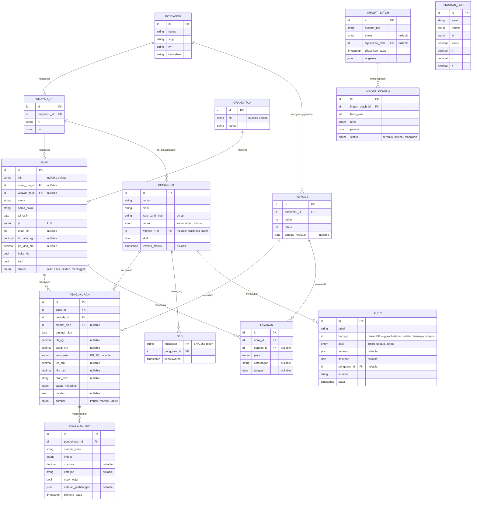

# Basis Data

| | |
|---|---|
| **Jenis** | Rujukan |
| **Status** | hidup |
| **Perubahan berarti terakhir** | 22 September 2026 |

Bentuk tabel, relasi antar tabel, dan aturan integritas Portal Posyandu Tulip. Inilah yang mengikat berkas migrasi di `server/db/migrations/`.

Kenapa bentuknya begini dan bukan yang lain, ada di [ADR-0001](adr/0001-primary-key-strategy.md) (kunci utama) dan [ADR-0006](adr/0006-pindah-ke-express-react-postgres.md) (pindah ke PostgreSQL). Aturan data yang mengikat seluruh sistem — DR-01 sampai DR-11 yang berkali-kali dirujuk di bawah — ada di [PRD utama](prd/prd-utama.md).

Dokumen ini dulu bagian 2 dari `03-sdd.md`, dipisah 22 September 2026 supaya skema basis data punya tempatnya sendiri.

---

## ERD

## Kamus data

Hanya kolom yang menuntut penjelasan. Kolom `id`, `created_at`, dan `updated_at` seragam di seluruh tabel dan tidak diulang di sini. `updated_at` dijaga trigger `set_updated_at`, bukan kode aplikasi — lihat `server/db/migrations/003_updated_at_dan_nik_terhapus.sql`.

### `wilayah_rt`

| Kolom | Tipe | Aturan |
|---|---|---|
| `posyandu_id` | FK → `posyandu` | Selalu Posyandu Tulip untuk saat ini. Tabel ini dulu bernama `teams` warisan *starter kit* Laravel ([ADR-0004](adr/0004-reuse-team-sebagai-rbac.md), sudah digantikan); sejak [ADR-0006](adr/0006-pindah-ke-express-react-postgres.md) namanya menyebut hal yang sebenarnya. |
| `rt` | `string(3)` | String, bukan integer — menjaga bentuk `01`. |
| `rw` | `string(3)` | Selalu `18` untuk saat ini. |

*Unique:* `(posyandu_id, rt, rw)`

### `orang_tua`

| Kolom | Tipe | Aturan |
|---|---|---|
| `nik` | `string(16)` `nullable` | *Unique*, boleh `NULL` (DR-02). |
| `nama` | `string` | Data sumber memuat bentuk `AYAH - IBU` dalam satu sel. Disimpan apa adanya; pemisahan menjadi dua entitas ditunda sampai ada kebutuhan nyata. |

### `anak`

| Kolom | Tipe | Aturan |
|---|---|---|
| `nik` | `string(16)` `nullable` | *Unique*, boleh `NULL` (DR-01, DR-02). |
| `nama` | `string` | Nama sebagaimana tertulis di sumber. |
| `nama_baku` | `string` | Nama yang sudah dibakukan, dipakai untuk pencarian dan pencocokan. Berasal dari kolom `NAMA_BAKU` arsip; bila kosong, diisi dari `nama`. |
| `tgl_lahir` | `date` | Wajib. Tanpa ini status gizi tidak dapat dihitung. |
| `jk` | `enum('L','P')` | Wajib. |
| `bb_lahir_kg` | `decimal(5,2)` `nullable` | **Kilogram.** Nilai sumber bersatuan gram (mis. `2986`) menjadi konflik impor, bukan dikonversi diam-diam. |
| `buku_kia`, `imd` | `boolean` | Sumber memuat teks `ada`/kosong; dinormalisasi saat impor. |
| `status` | `enum` | `aktif`, `lulus` (> 60 bulan), `pindah`, `meninggal`. Hanya `aktif` yang masuk hitungan sasaran (S). |

*Unique:* `nik` (mengizinkan banyak `NULL`)
*Index:* `nama_baku`, `wilayah_rt_id`, `tgl_lahir`

### `periode`

| Kolom | Tipe | Aturan |
|---|---|---|
| `bulan` | `tinyint` | 1–12. |
| `tahun` | `smallint` | |
| `tanggal_kegiatan` | `date` `nullable` | Tanggal penimbangan. Boleh kosong untuk periode hasil impor arsip. |

*Unique:* `(posyandu_id, bulan, tahun)`

### `pengukuran`

| Kolom | Tipe | Aturan |
|---|---|---|
| `tanggal_ukur` | `date` | Wajib. Bersama `anak.tgl_lahir` menentukan umur (DR-03). |
| `bb_kg` | `decimal(5,2)` `nullable` | Kosong berbeda dari nol (DR-04). |
| `tinggi_cm` | `decimal(5,1)` `nullable` | Nilai ukur asli, sebelum konversi PB↔TB. |
| `jenis_ukur` | `enum('PB','TB')` `nullable` | DR-05. `NULL` berarti tidak diketahui; perhitungan mengasumsikan dari umur dan mencatat asumsinya. |
| `ntob_raw` | `string(8)` `nullable` | Nilai mentah dari sumber, sudah di-*trim*. **Tidak ada logika turunan** sampai definisinya dikonfirmasi (DR-08). |
| `status_kehadiran` | `enum` | `hadir`, `tidak_hadir`, `pindah`, `tidak_dapat_diukur`. Menampung teks seperti `PINDAH RUMAH` yang di sumber menempati kolom berat (DR-04). |
| `sumber` | `enum` | `import`, `manual`, `tablet`. Membuat asal setiap rekam dapat ditelusuri dan membuat pengiriman ulang bersifat *idempotent*. |

*Unique:* `(anak_id, periode_id)` — DR-10
*Index:* `periode_id`, `tanggal_ukur`

### `penilaian_gizi`

| Kolom | Tipe | Aturan |
|---|---|---|
| `standar_versi` | `string(20)` | Mis. `WHO-2006`. DR-06. |
| `indeks` | `enum` | `BB_U`, `TB_U`, `BB_TB`, `IMT_U`, `LILA_U`, `LIKA_U`. |
| `z_score` | `decimal(6,3)` `nullable` | `NULL` bila prasyarat tidak lengkap (DR-07). |
| `kategori` | `string(40)` `nullable` | Label PMK 2/2020. `NULL` untuk `LILA_U` sampai OI-04 selesai. |
| `tidak_wajar` | `boolean` | Nilai di luar rentang biologis WHO. Ditandai, bukan dibuang. |
| `catatan_perhitungan` | `json` `nullable` | Mis. `{"jenis_ukur":"diasumsikan dari umur"}`. Membuat asumsi terlihat, bukan tersembunyi. |

*Unique:* `(pengukuran_id, indeks, standar_versi)`

### `standar_lms`

| Kolom | Tipe | Aturan |
|---|---|---|
| `versi` | `string(20)` | `WHO-2006`. Versi baru ditambahkan, tidak menimpa. |
| `kunci` | `decimal(5,1)` | Umur dalam bulan (indeks `*_U`) atau panjang/tinggi cm (`BB_TB`). |
| `l`, `m`, `s` | `decimal(10,6)` | Disimpan **per baris**, bukan per tabel — lihat temuan OI-05 di [`rujukan/antropometri.md`](rujukan/antropometri.md). |

*Unique:* `(versi, indeks, jk, kunci)`
Isi awal: 906 baris.

### `layanan`

Satu tabel untuk imunisasi, Vitamin A, dan obat cacing, dibedakan kolom `jenis`. Tiga tabel terpisah tidak menyediakan apa pun yang tidak disediakan satu kolom enum, sementara ketiganya sama-sama berupa "anak menerima sesuatu pada suatu periode".

| Kolom | Tipe | Aturan |
|---|---|---|
| `jenis` | `enum` | `imunisasi`, `vitamin_a`, `obat_cacing`. |
| `keterangan` | `string` `nullable` | Nama antigen atau dosis. |
| `periode_id` | FK `nullable` | Boleh kosong untuk layanan di luar jadwal Posyandu. |

### `import_batch`, `import_konflik`

Jejak audit impor (DR-09). `import_konflik.jenis`: `nik_ganda`, `tgl_lahir_bentrok`, `nama_mirip`, `satuan_meragukan`, `nilai_bukan_angka`, `anak_tidak_dikenal`.

### `audit`

Jejak perubahan (DR-09). Diisi **trigger**, bukan kode aplikasi, sehingga tidak ada jalur mutasi yang bisa lupa mencatat — termasuk perubahan lewat `psql` langsung. Keputusannya di [ADR-0007](adr/0007-jejak-audit-lewat-trigger.md).

| Kolom | Tipe | Aturan |
|---|---|---|
| `tabel`, `baris_id` | `text`, `bigint` | Baris mana yang berubah. Bukan *foreign key*: jejaknya harus bertahan setelah barisnya dihapus |
| `aksi` | `text` | `insert`, `update`, atau `delete` |
| `sebelum`, `sesudah` | `jsonb` | Baris **utuh**, bukan hanya kolom yang berubah. `sebelum` kosong pada insert, `sesudah` kosong pada delete |
| `pengguna_id` | FK → `pengguna` `nullable` | `ON DELETE SET NULL` — menghapus akun tidak menghapus jejaknya. Kosong untuk perubahan dari baris perintah |
| `sumber` | `text` | Mis. `aplikasi`, `cli`, `hitung-gizi`. `tidak diketahui` bila aplikasi tidak menyetelnya |

*Index:* `(tabel, baris_id, pada DESC)` dan `(pengguna_id, pada DESC)` — dua bentuk pertanyaan yang nyata: riwayat satu baris, dan apa yang dikerjakan satu pengguna.

**Tabel yang diaudit:** `anak`, `orang_tua`, `pengukuran`, `layanan`, `periode`, `wilayah_rt`, `pengguna`.

`penilaian_gizi` sengaja di luar daftar: ia hasil turunan yang dihitung ulang setiap kali nilai ukur dikoreksi, dan menghitung ulang satu periode 101 anak menulis sekitar 1.200 baris untuk angka yang dapat dihasilkan ulang kapan saja.

Tabel ini tidak pernah menghapus isinya sendiri. Kebijakan retensinya menunggu [OI-10](pertanyaan-terbuka.md).

## Enum

Enum berupa *union type* TypeScript, bukan `string` bebas — di `server/src/antropometri/indeks.ts`, `server/src/auth/peran.ts`, dan `client/src/types/posyandu.ts`. Bukan `enum` TypeScript: Node menjalankan berkas `.ts` dengan membuang anotasi tipe, dan `enum` bukan sintaks yang dapat dibuang begitu saja (`erasableSyntaxOnly`).

Di basis data nilainya tersimpan sebagai `text` dengan `CHECK`, bukan tipe enum PostgreSQL: menambah satu nilai pada `CHECK` adalah satu `ALTER`, sedangkan pada tipe enum ia menyeret dependensi tipe. Tersimpan sebagai teks juga agar terbaca saat inspeksi manual.

---

