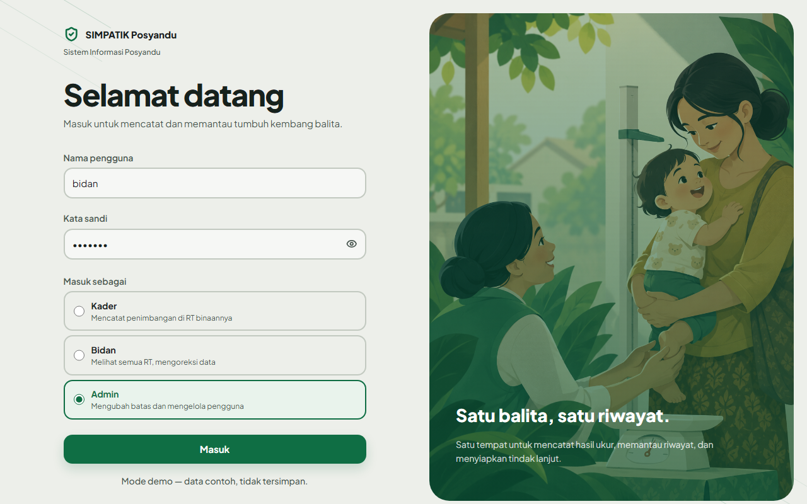
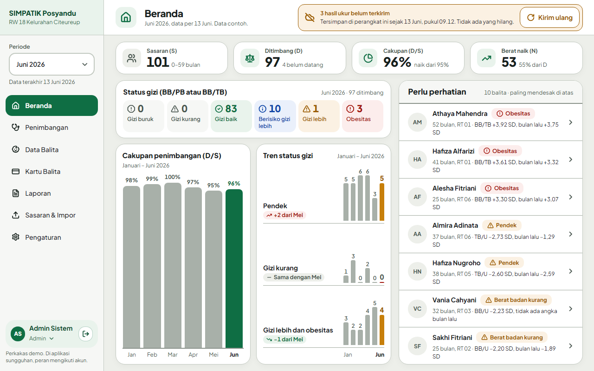
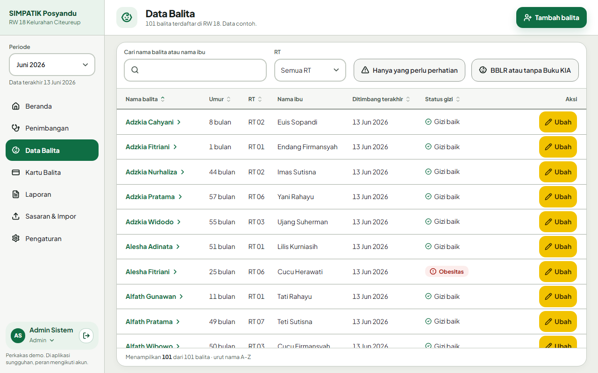
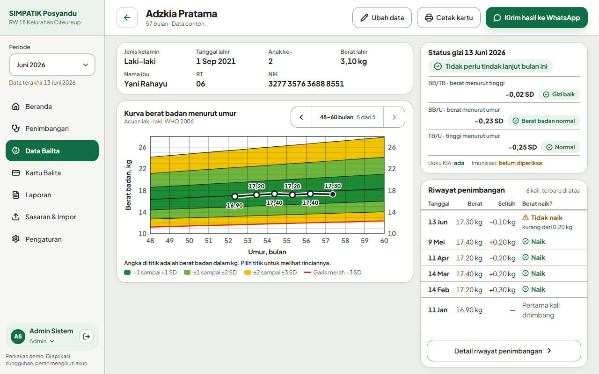
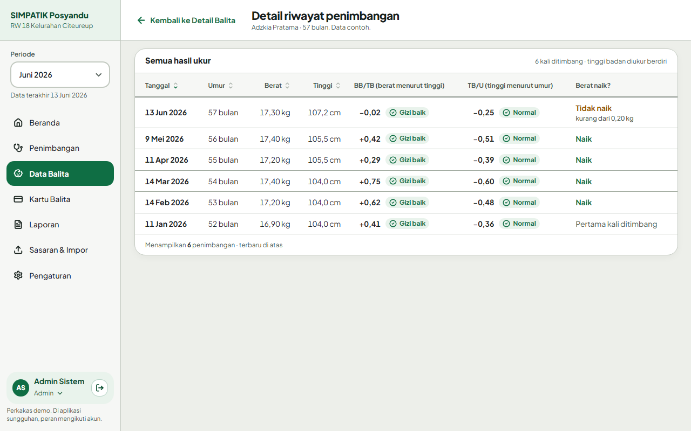
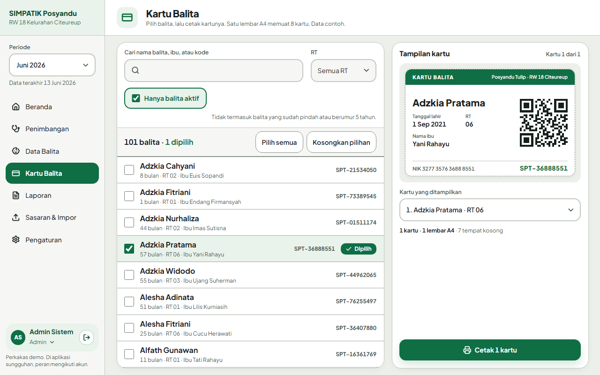
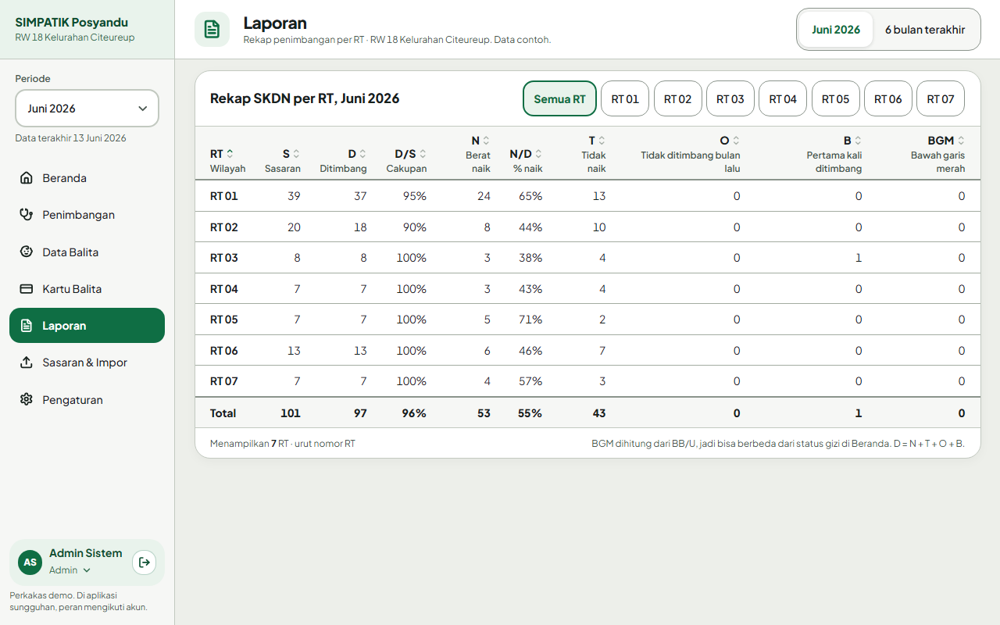
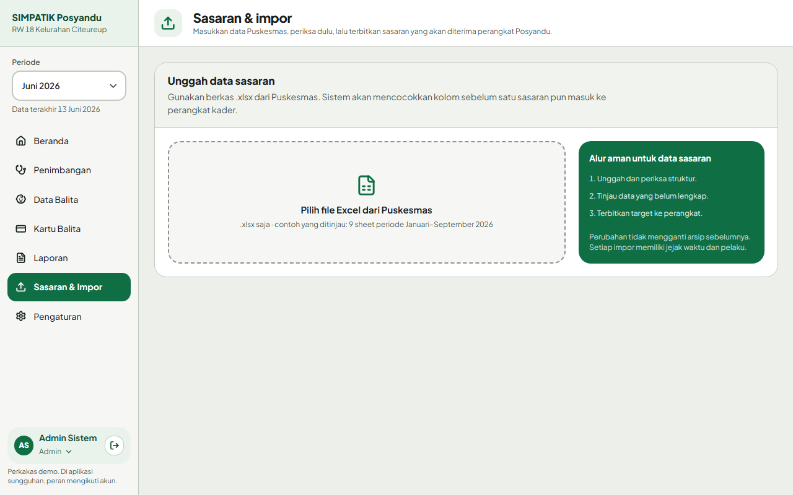
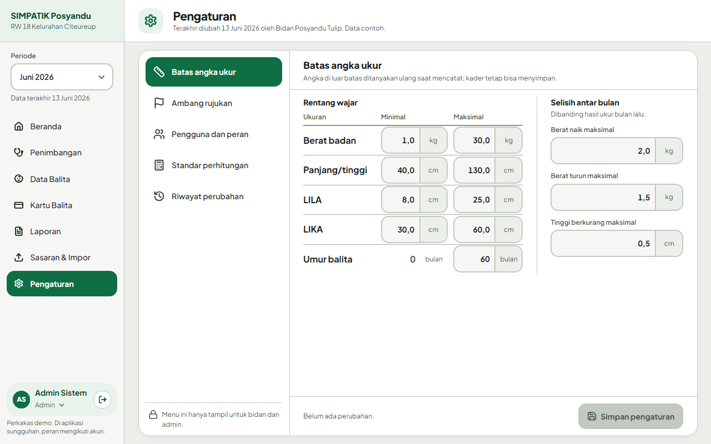

# Mulai di sini

| | |
|---|---|
| **Jenis** | Orientasi |
| **Status** | hidup |
| **Perubahan berarti terakhir** | 1 Oktober 2026 |

Halaman pertama bagi anggota tim baru. Isinya: aplikasi ini apa, layarnya apa saja, siapa yang memakainya, dan apa yang dibaca berikutnya. Sekitar sepuluh menit.

---

## Aplikasi ini apa

**SIMPATIK Posyandu** adalah aplikasi web internal Posyandu Tulip, RW 18 Kelurahan Citeureup. Kader, bidan, dan admin memakainya untuk mengelola sasaran, memantau status gizi, dan menyusun laporan bulanan. Pengukuran balita dicatat melalui aplikasi Android, bukan website. Sistem ini menggantikan puluhan berkas Excel yang selama ini dicocokkan dengan tangan.

Status gizi dihitung otomatis dari standar WHO 2006 dengan kategori PMK No. 2 Tahun 2020.

Dokumen yang lebih lama menyebutnya **Portal Posyandu Tulip**, atau cukup **Portal**. Ketiganya aplikasi yang sama; nama SIMPATIK dipakai di layar sejak 24 September 2026. "Portal" tetap dipakai untuk membedakannya dari **Aplikasi Tablet**, aplikasi Android terpisah untuk meja penimbangan yang pemindai kartunya (v1.6) sudah dipakai ([ADR-0003](adr/0003-batas-portal-vs-aplikasi-tablet.md)).

### Yang sudah nyata hari ini

| Bagian | Keadaan |
|---|---|
| Masuk, keluar, dan tiga peran | Tersambung ke basis data; hak akses ditegakkan server |
| Pengaturan › Pengguna dan peran | Tersambung ke basis data |
| Perhitungan status gizi | Berjalan di server dan teruji terhadap 2.076 kasus |
| Data Balita | Tersambung ke REST API dan basis data live |
| Dashboard, laporan, kartu, impor, dan sebagian detail | Tampilan sudah jadi, tetapi sebagian isinya masih **[data contoh](rujukan/data-contoh.md)** |
| Input pengukuran | Hanya di aplikasi Android; halaman web lamanya ada di [`archive-fitur/penimbangan`](../archive-fitur/penimbangan/README.md) |

Rinciannya di [Fitur](fitur.md).

---

## Peta layar

Delapan layar setelah masuk, ditambah layar Masuk. Alamatnya memakai tanda `#`, misalnya `#/balita/19`. Berkas halamannya ada di `client/src/pages/`.

| No. | Layar (nama menu) | Alamat | Peran | Untuk apa | Berkas |
|---|---|---|---|---|---|
| — | Masuk | — | semua | Nama pengguna dan kata sandi | `auth/login.tsx` |
| 1 | Beranda | `#/beranda` | K · B · A | Ringkasan bulan berjalan dan balita yang perlu perhatian | `dashboard.tsx` |
| 2 | Data Balita | `#/balita` | K · B · A | Daftar balita: cari, saring, tambah, dan ubah | `anak/index.tsx` |
| 3 | Detail Balita | `#/balita/{id}` | K · B · A | Identitas, kurva KMS, status gizi, dan riwayat singkat | `anak/show.tsx` |
| 4 | Detail riwayat penimbangan | `#/balita/{id}/riwayat` | K · B · A | Semua hasil ukur satu balita | `anak/riwayat.tsx` |
| 5 | Kartu Balita | `#/kartu-sasaran` | B · A | Pilih balita, lalu cetak kartu ber-QR | `kartu-sasaran/index.tsx` |
| 6 | Laporan | `#/laporan` | K · B · A | Rekap SKDN per RT, bulanan atau enam bulan | `laporan/index.tsx` |
| 7 | Sasaran & Impor | `#/sasaran` | A | Rancangan alur impor data sasaran dari Puskesmas | `sasaran/index.tsx` |
| 8 | Pengaturan | `#/pengaturan` | B · A | Batas angka ukur, ambang rujukan, akun, dan standar perhitungan | `pengaturan/index.tsx` |

K = Kader, B = Bidan, A = Admin. Detail Balita dan Detail riwayat penimbangan tidak punya menu sendiri; keduanya dibuka dari Data Balita atau Beranda.

Tangkapan di bawah diambil dari demo sebagai Admin pada 1280 × 800 px (tablet mendatar), 29 September 2026. Semua nama dan NIK di dalamnya sudah diganti.

### Masuk



Nama pengguna dan kata sandi. Pilihan peran di bawahnya hanya ada di demo; di aplikasi sungguhan, peran mengikuti akun.

### 1. Beranda



Empat angka bulan berjalan (S, D, D/S, dan N), sebaran status gizi, cakupan penimbangan dan tren enam bulan, serta daftar **Perlu perhatian** yang paling mendesak di atas. Periode dipilih di sidebar.

### 2. Data Balita



Tabel seluruh balita, digulir di dalam kartunya. Tombol **Tambah balita** dan **Ubah** hanya tampil bagi bidan dan admin. Kader hanya melihat balita di RT binaannya.

### 3. Detail Balita



Satu layar untuk satu balita: identitas, kurva berat badan menurut umur (KMS), status gizi tiga indeks, dan riwayat penimbangan singkat. **Ubah data** dan **Cetak kartu** hanya untuk bidan dan admin.

### 4. Detail riwayat penimbangan



Semua hasil ukur satu balita, beserta z-score dan kategori BB/TB dan TB/U. Dibuka dari tombol di bawah kartu Riwayat penimbangan.

### 5. Kartu Balita



Pilih satu atau beberapa balita, periksa tampilan kartunya, lalu cetak. Satu lembar A4 memuat delapan kartu. QR di kartu dipindai melalui aplikasi Android; kodenya `SPT-` dan id balita, misalnya `SPT-00000110`.

### 6. Laporan



Rekap SKDN per RT: S, D, D/S, N, N/D, T, O, B, dan BGM. Bisa untuk bulan terpilih atau enam bulan terakhir.

### 7. Sasaran & Impor



Rancangan alur memasukkan data sasaran dari Puskesmas: unggah, tinjau, terbitkan. Berkasnya belum dibaca; langkah-langkahnya hanya diperagakan. Aturan impor yang sebenarnya ada di [Migrasi data](rujukan/migrasi-data.md).

### 8. Pengaturan



Lima bagian: Batas angka ukur, Ambang rujukan, Pengguna dan peran (khusus admin), Standar perhitungan, dan Riwayat perubahan. Hanya Pengguna dan peran yang sudah tersimpan ke basis data.

---

## Siapa yang memakainya

| Peran | Siapa | Menu yang tampil |
|---|---|---|
| **Kader** | Relawan RT, umumnya bukan pengguna komputer harian | Beranda, Data Balita, Laporan. Datanya terbatas pada RT binaannya |
| **Bidan** | Penanggung jawab kebenaran data dan keputusan klinis | Menu kader, ditambah Kartu Balita dan Pengaturan |
| **Admin** | Pengelola teknis, misalnya mahasiswa KKN | Semua menu, termasuk Sasaran & Impor dan Pengguna dan peran |

Peran yang lebih tinggi mewarisi hak peran di bawahnya. Menyembunyikan menu hanya kenyamanan; penolakan yang mengikat ada di server ([Arsitektur — Otorisasi](arsitektur.md#otorisasi)).

---

## Mencoba aplikasinya

Cara tercepat adalah demo, tanpa basis data:

```bash
npm --prefix client ci
npm --prefix client run demo
```

Buka alamat yang dicetak Vite di terminal. Peran dipilih di layar Masuk, kata sandi tidak diperiksa, dan tidak ada yang tersimpan.

Menjalankan aplikasi lengkap dengan API dan PostgreSQL dijelaskan di [README](../README.md).

---

## Baca apa berikutnya

| Tujuan | Baca |
|---|---|
| Memahami masalah yang dipecahkan dan batas produknya | [Ringkasan](ringkasan.md) |
| Mengetahui apa yang sudah berjalan dan apa yang belum | [Fitur](fitur.md) |
| Menjalankan aplikasi di komputer sendiri | [README](../README.md) |
| Mengubah kode server atau antarmuka | [Arsitektur](arsitektur.md), lalu [Basis Data](database.md) |
| Mengubah tampilan | [UI/UX](rujukan/ui-ux.md) |
| Menyentuh perhitungan gizi | [Antropometri](rujukan/antropometri.md) |
| Mengambil pekerjaan berikutnya | [Rencana kerja](rencana-kerja.md) dan [Pertanyaan terbuka](pertanyaan-terbuka.md) |
| Menulis atau menyunting dokumen | [Panduan penulisan](panduan-penulisan.md) |
| Bertemu istilah asing (SKDN, KBM, D/S, BGM) | [Glosarium](glosarium.md) |

Peta seluruh dokumen ada di [docs/README](README.md).
