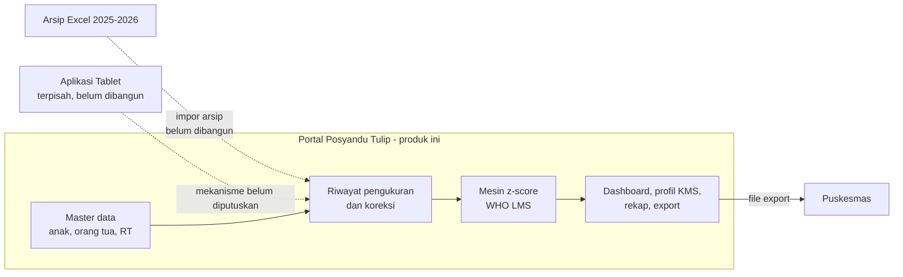

# Ringkasan Portal Posyandu Tulip

| | |
|---|---|
| **Jenis** | Orientasi |
| **Status** | hidup |
| **Perubahan berarti terakhir** | 22 September 2026 |

Berkas pertama yang sebaiknya dibaca. Isinya: aplikasi ini apa, masalah apa yang dipecahkannya, siapa yang memakainya, dan di mana batasnya.

Apa saja yang bisa dilakukannya ada di [Fitur](fitur.md). Bagaimana ia disusun ada di [Arsitektur](arsitektur.md).

---

## Apa ini

Portal Posyandu Tulip adalah aplikasi web internal untuk kader, Bidan, dan admin Posyandu Tulip. Portal menyimpan satu profil tetap per balita, satu riwayat pertumbuhan lintas bulan dan tahun, menghitung status gizi secara otomatis dari standar WHO, dan menghasilkan rekap yang selama ini disusun manual dari puluhan file Excel.

Portal adalah *system of record* dan pusat analitik. Portal **bukan** aplikasi input lapangan.

## Masalah yang dipecahkan

Arsip Posyandu Tulip saat ini tersebar di puluhan file Excel yang terbagi tiga sumbu sekaligus: per bulan, per jenis laporan, dan per indeks Z-score. Akibat yang terukur dari inventaris data:

| Gejala | Bukti dari arsip |
|---|---|
| Identitas anak tidak stabil | 1.054 baris rekap 2025 menghasilkan **129 variasi nama** untuk **124 NIK** terisi. Ada kolom `NAMA_BAKU`/`PERBAIKAN_NAMA` yang dipelihara manual. |
| Identitas tidak lengkap | 8 baris tanpa NIK; 4 NIK memiliki **tanggal lahir yang saling bertentangan** antar file. |
| Riwayat anak terputus | Untuk melihat pertumbuhan satu anak, petugas harus membuka 12 file atau lebih dan mencocokkan nama secara manual. |
| Perhitungan terduplikasi | Z-score dihitung ulang di tujuh file berbeda (`0_REKAP ... Z SCORE ...`), masing-masing dengan formula sendiri. |
| Tipe data rusak | Nilai `PINDAH RUMAH` muncul di kolom berat badan. NIK terbaca sebagai angka sehingga nol di depan hilang. Berat lahir tercatat `2986` (gram) bercampur dengan `2.9` (kg). |
| Duplikasi file | `6_JUNI 2026_MASTER Z SCORE.xlsx` ada identik di dua folder berbeda. |

Konsekuensinya: rekap bulanan memakan waktu berjam-jam, angka antar-laporan bisa berbeda, dan anak yang perlu tindak lanjut bisa terlewat karena riwayatnya tidak terbaca sebagai satu garis.

## Siapa yang memakainya

Portal bersifat **internal**. Tidak ada akses publik dan tidak ada akun untuk orang tua.

| Persona | Konteks | Kebutuhan utama |
|---|---|---|
| **Kader** | Relawan RW, umumnya bukan pengguna komputer harian. Mengurus anak-anak di RT-nya. | Mencari anak dengan cepat, melihat riwayat dan status gizi anak binaannya, mengetahui siapa yang belum hadir. |
| **Bidan / Koordinator** | Penanggung jawab kebenaran data dan keputusan klinis. | Mengoreksi profil dan pengukuran, memutuskan penggabungan data duplikat, melihat seluruh RT, menyiapkan bahan laporan Puskesmas. |
| **Admin sistem** | Mahasiswa KKN atau pengelola teknis. | Mengelola akun dan peran, menjalankan impor arsip, mengelola periode kegiatan, dan *backup*. |

Peran diurutkan menaik: Kader < Bidan < Admin. Peran yang lebih tinggi memiliki seluruh hak peran di bawahnya.

## Batas sistem

Dua garis putus-putus adalah jalur masuk data yang **belum berdiri**:

- **Impor arsip Excel.** Rancangannya lengkap di [`rujukan/migrasi-data.md`](rujukan/migrasi-data.md), tetapi perintahnya belum dibangun di stack sekarang — lihat butir 3 pada [`rencana-kerja.md`](rencana-kerja.md).
- **Aplikasi Tablet.** Cara ia menyerahkan data ke Portal (basis data bersama, impor berkala, atau API) belum diputuskan. Data model Portal dirancang netral terhadap ketiganya.

Garis penuh menggambarkan rancangan, bukan keadaan hari ini. Keempat kotak di dalam Portal tidak sama-sama berdiri — mana yang sudah dan mana yang belum ada di [Fitur](fitur.md), dan urutan mengerjakan sisanya di [Rencana kerja](rencana-kerja.md).

