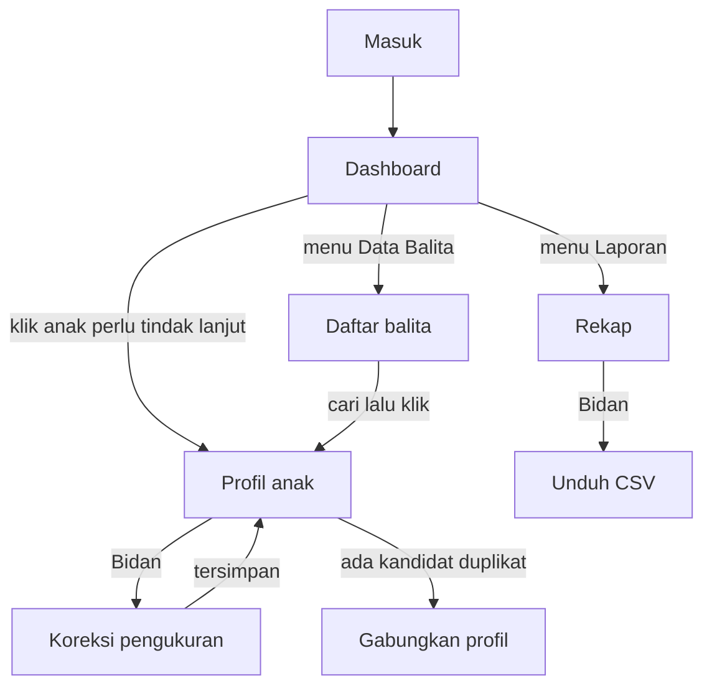

# Rencana struktur halaman

| | |
|---|---|
| **Jenis** | Sejarah — rencana sebelum kesembilan layar dibangun |
| **Status** | beku |
| **Perubahan berarti terakhir** | 29 September 2026 — dipindah dari [UI/UX](../rujukan/ui-ux.md) bagian 5–7 |

Susunan menu, isi halaman, alur, dan perilaku responsif yang direncanakan pada September 2026, sebelum mockup 26 September 2026 dan kesembilan layar yang sekarang. Menunya dulu Dashboard, Data Balita, Periode, dan Laporan › Rekap; halaman Periode dan form profil anak tersendiri tidak pernah dibangun.

Peta layar yang berlaku ada di [Mulai di sini](../mulai-di-sini.md#peta-layar). Nomor bagian di bawah dipertahankan seperti aslinya.

---

## 5. Struktur halaman

> **Ini struktur Portal yang dituju, bukan yang sudah dibangun.** Sebagian isinya belum ada di demo — tren stunting per RT pada 5.2, misalnya. Tata letak persis, susunan kartu, bunyi kalimat, dan state kosong dari yang **benar-benar dibangun** ada di [`riwayat/layar-demo.md`](layar-demo.md) bagian 6. Bila keduanya berbeda, di sinilah rencananya dan di sana keadaannya.

### 5.1 Navigasi

Sidebar tetap (komponen `sidebar` bawaan, varian `inset`):

```text
Posyandu Tulip
├── Dashboard
├── Data Balita
├── Periode
└── Laporan
    └── Rekap
```

Entri "Periode" hanya tampil bagi Admin. Menu Pengaturan tetap berada paling bawah.

### 5.2 Dashboard

| Bagian | Isi |
|---|---|
| Pemilih periode | Default: periode terbaru. |
| Kartu ringkasan | Sasaran (S), Ditimbang (D), D/S dalam persen, jumlah anak perlu tindak lanjut. |
| Sebaran status gizi | Tiga indeks inti, masing-masing menampilkan jumlah anak per kategori. |
| Tren stunting | Persentase `TB/U < -2 SD` per periode, per RT. |
| Daftar tindak lanjut | Anak dengan kategori bermasalah. Disusun dari status gizi saja — **bukan** dari 1T/2T/3T (OI-01). |

### 5.3 Data Balita — daftar

Tabel dengan pencarian di atasnya. Kolom: Nama, NIK, JK, Umur, RT, Pengukuran terakhir, Status BB/TB, Status TB/U.

Filter: RT, status anak, periode, kategori status gizi. Pencarian mencakup `nama` dan `nama_baku` sekaligus.

Baris dapat diklik untuk membuka profil. Tombol "Tambah Anak" hanya tampil bagi Bidan ke atas.

### 5.4 Profil anak

| Bagian | Isi |
|---|---|
| Identitas | Nama, NIK, tanggal lahir, umur berjalan, JK, RT, orang tua, status. Penanda bila ada kandidat duplikat. |
| Kurva KMS | Garis SD sebagai latar, titik pengukuran anak di atasnya. Indeks dapat dipilih. |
| Riwayat pengukuran | Satu baris per periode: tanggal, BB, TB/PB beserta jenis ukurnya, LILA, LIKA, lalu enam pasang kolom z-score dan status. |
| Layanan | Imunisasi, Vitamin A, obat cacing. Kosong sampai ada sumber data. |
| Aksi | Ubah profil, koreksi pengukuran, gabungkan duplikat — sesuai peran. |

Baris riwayat yang memuat asumsi (mis. `jenis_ukur` ditebak dari umur) menampilkan keterangan itu — prinsip P4.

### 5.5 Rekap

Tabel lebar dengan susunan kolom sesuai FR-23. Karena lebarnya, tabel **menggulir di dalam wadahnya sendiri**; badan halaman tidak pernah menggulir horizontal (NFR-02). Kolom Nama dibekukan di kiri.

Filter: periode, RT, indeks, kategori. Tombol Unduh CSV hanya untuk Bidan ke atas.

### 5.6 Periode

Daftar periode beserta jumlah pengukurannya. Aksi buat dan ubah hanya untuk Admin.

---

## 6. Alur pengguna



Alur terpendek yang paling sering dipakai — kader mencari seorang anak lalu membaca riwayatnya — harus selesai dalam **dua klik dari Dashboard**.

---

## 7. Responsif

| Lebar | Perilaku |
|---|---|
| ≥ 1280 px | Sidebar terbuka; tabel tampil penuh. |
| 1024–1279 px | Sidebar dapat diciutkan menjadi ikon. |
| 768–1023 px | Sidebar menjadi *sheet*; tabel lebar menggulir di dalam wadahnya. |
| < 768 px | Didukung sebatas dapat dibaca, tidak dioptimalkan. Pemakaian di ponsel bukan sasaran Portal. |

Aturan mengikat: **badan halaman tidak pernah menggulir horizontal.** Konten lebar — tabel, grafik — menggulir di dalam wadahnya sendiri.
