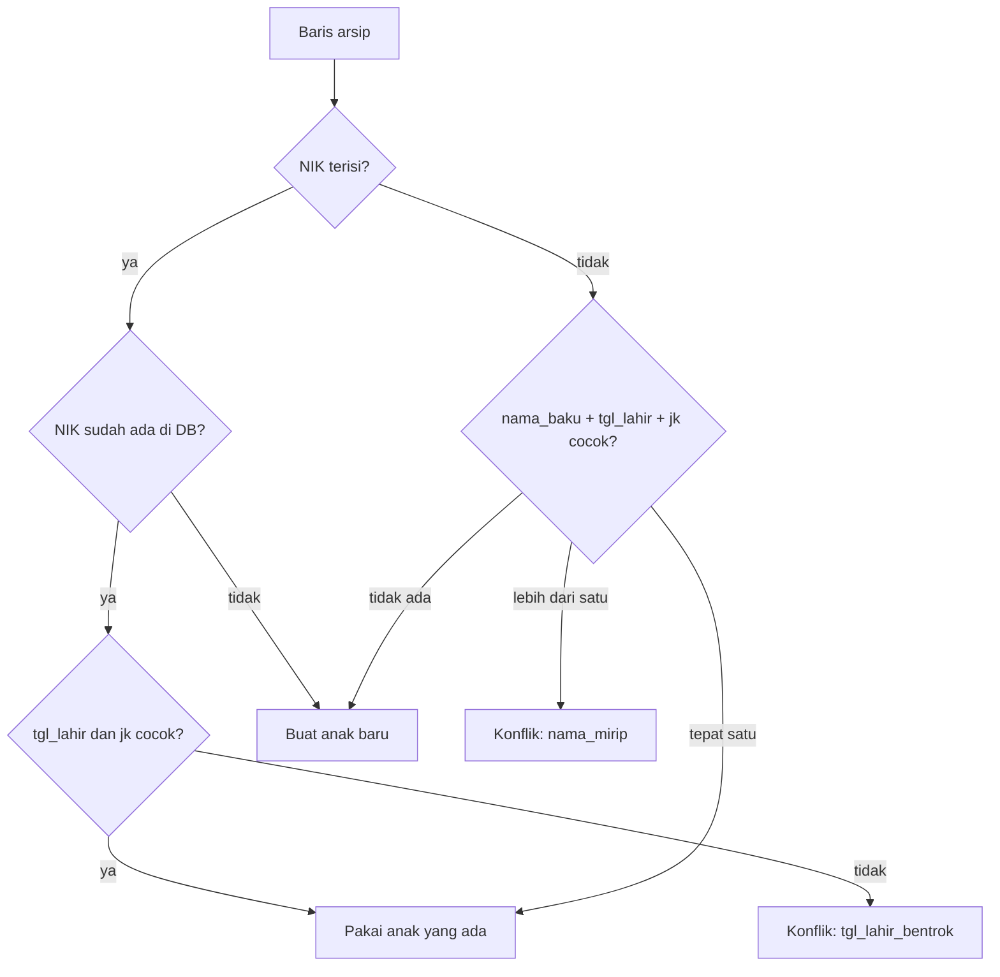

# Migrasi Data Arsip Excel

| | |
|---|---|
| **Jenis** | Kontrak — rancangan impor |
| **Status** | selesai |
| **Perubahan berarti terakhir** | 21 September 2026 |

Spesifikasi perintah impor arsip 2025–2026 ke basis data Portal.

> **Belum dibangun.** Perintah ini dirancang untuk Laravel dan tidak ikut diport ([ADR-0006](../adr/0006-pindah-ke-express-react-postgres.md)). Aturan normalisasi, pencocokan identitas, dan penanganan konflik di bawah tetap berlaku apa adanya; yang berubah hanya bentuk perintahnya — nanti sebuah skrip di `server/db/`, sekelas dengan `migrate.ts` dan `seed-standar-lms.ts`.

Selama Aplikasi Tablet belum ada, perintah ini adalah **satu-satunya jalur masuk data pengukuran** ([ADR-0003](../adr/0003-batas-portal-vs-aplikasi-tablet.md)). Karena itu ia diperlakukan sebagai jalur kritis, bukan sekadar utilitas.

---

## 1. Prinsip

1. **Tidak menebak.** Baris yang meragukan masuk antrean konflik dan diputuskan manusia. Baris yang bersih tetap masuk.
2. **Tidak mengubah nilai mentah diam-diam.** Setiap normalisasi yang mengubah arti nilai — satuan, tipe, kategori — menjadi konflik, bukan konversi otomatis.
3. **Dapat diulang.** Menjalankan berkas yang sama dua kali tidak menghasilkan pengukuran ganda.
4. **Dapat diuji lebih dulu.** `--dry-run` melaporkan segalanya tanpa menulis apa pun.
5. **Dapat ditelusuri.** Setiap baris yang masuk membawa jejak berkas, sheet, dan nomor baris asalnya.

---

## 2. Antarmuka perintah

```bash
node --env-file=.env db/impor-arsip.ts <path> [--periode=YYYY-MM] [--uji-coba] [--batch=]
```

| Argumen | Arti |
|---|---|
| `path` | Berkas `.xlsx` tunggal, atau direktori yang isinya diproses berurutan. |
| `--periode` | Periode tujuan bila berkas tidak memuat kolom bulan (berkas 2026). Format `2026-06`. |
| `--dry-run` | Proses dan laporkan tanpa menulis ke basis data. |
| `--batch` | Melanjutkan `import_batch` yang sudah ada, bukan membuat yang baru. |

Keluaran:

- Ringkasan di terminal: jumlah baris dibaca, anak baru, anak dikenali, pengukuran dibuat, pengukuran dilewati, dan konflik per jenis.
- `storage/app/import/{batch_id}-konflik.csv` berisi seluruh konflik beserta nomor baris asalnya.

---

## 3. Berkas sumber

Urutan dan pilihan berkas mengikuti inventaris data yang sudah dilakukan. Berkas yang merupakan **hasil olahan** (rekap Z-score, F1, Buku 7) **tidak** diimpor — semuanya adalah keluaran yang akan dihasilkan ulang oleh aplikasi.

### 3.1 Riwayat 2025

| Berkas | Sheet | Baris |
|---|---|---|
| `MASTER_DATABASE/REKAP_DATA_POSYANDU-2025.xlsx` | `Rekap Data Excel 2025` | 1.054 data |

Berkas ini sudah menggabungkan 12 berkas bulanan dan membawa kolom provenance sendiri. Berkas bulanan di `Rekap Data Excel 2025/` **tidak** diimpor terpisah agar tidak menghasilkan duplikat.

### 3.2 Riwayat 2026

Enam berkas di `REKAP TAHUN 2026/`, masing-masing satu tabel tunggal dengan sheet bernama periode:

| Berkas | Sheet | Periode |
|---|---|---|
| `JANUARO_2026.XLSX` | `JANUARI_2026` | 2026-01 |
| `FEBRUARI_2026_HASIL.xlsx` | `FEBRUARI_2026` | 2026-02 |
| `MARET_2026_HASIL.xlsx` | `MARET_2026` | 2026-03 |
| `APRIL_2026_HASIL.xlsx` | `APRIL_2026` | 2026-04 |
| `MEI_HASIL_EKSTRAK.xlsx` | `MEI_2026` | 2026-05 |
| `REKAP JUNI 2026.xlsx` | `JUNI_2026` | 2026-06 |

### 3.3 Berkas yang sengaja tidak diimpor

| Berkas | Alasan |
|---|---|
| `MASTER_DATABASE/MASTER_DATABASE 2026 & 2025.xlsx` | Gabungan berprovenance yang memuat kolom hasil olahan dan baris non-data. Berguna sebagai arsip pembanding. |
| `MASTER_DATABASE/REKAP_DATA_POSYANDU-2026.xlsx` | Beririsan dengan berkas `REKAP TAHUN 2026/`. Dipakai untuk rekonsiliasi, bukan sumber. |
| `Rekap Data Excel 2025/*.xlsx` | Sudah tercakup rekap 2025. |
| `Excel ibu Sri/0_REKAP ... Z SCORE ...` | Hasil perhitungan. Akan dihasilkan ulang aplikasi, dan dipakai sebagai *acceptance test*. |
| `Output Laporan/*F1*.xlsx`, `3_rekap buku 7_shared.xlsx` | Keluaran laporan. |
| `6_JUNI 2026_MASTER Z SCORE.xlsx` | Ada identik di dua folder. Dipakai sebagai *fixture* uji, bukan sumber impor. |
| Berkas berawalan `~$` | Berkas kunci sementara Excel. Dilewati. |

---

## 4. Pemetaan kolom

Susunan kolom berikut sudah diverifikasi langsung dari berkasnya, bukan dari dokumentasi.

### 4.1 Format 2026 (22 kolom)

| Kolom | Header | Tujuan | Catatan |
|---|---|---|---|
| A | `NO` | — | Nomor urut per berkas. Bukan identitas. Diabaikan. |
| B | `NIK` | `anak.nik` | Dibaca sebagai teks. Boleh kosong. |
| C | `NAMA ANAK` | `anak.nama`, `anak.nama_baku` | Format 2026 tidak punya kolom nama baku. |
| D | `ANAK KE` | `anak.anak_ke` | |
| E | `BB LHR` | `anak.bb_lahir_kg` | Cek satuan (bagian 5.5). |
| F | `PB LHR` | `anak.pb_lahir_cm` | |
| G | `BUKUKIA` | `anak.buku_kia` | `ada` → `true`; kosong → `false`. |
| H | `IMD` | `anak.imd` | idem |
| I | `TGL LAHIR` | `anak.tgl_lahir` | String ISO `2026-01-20`. |
| J | `JK` | `anak.jk` | `L` / `P`. |
| K | `NAMA ORTU` | `orang_tua.nama` | Bisa berbentuk `AYAH - IBU`. |
| L | `NIK ORTU` | `orang_tua.nik` | Teks. Boleh kosong. |
| M | `RT` | `wilayah_rt.rt` | Teks. |
| N | `RW` | `wilayah_rt.rw` | Teks. |
| O | `TANGGAL UKUR` | `pengukuran.tanggal_ukur` | String ISO. |
| P | `BB` | `pengukuran.bb_kg` | |
| Q | `TB` | `pengukuran.tinggi_cm` | |
| R | `NTOB` | `pengukuran.ntob_raw` | Di-*trim*. Tanpa logika turunan (DR-08). |
| S | `LILA` | `pengukuran.lila_cm` | |
| T | `LIKA` | `pengukuran.lika_cm` | |
| U | `UMUR LENGKAP` | — | **Diabaikan.** Dihitung ulang (DR-03). |
| V | `UMUR HARI` | — | **Diabaikan.** |

### 4.2 Format 2025 (28 kolom)

Sama seperti 2026, dengan tambahan kolom provenance dan nama baku:

| Kolom | Header | Tujuan | Catatan |
|---|---|---|---|
| A | `NAMA FILE` | `import_konflik.payload` | Provenance baris. |
| B | `BULAN` | `periode` | Mis. `JANUARI_2025` → periode 2025-01. |
| C | `No` | — | Diabaikan. |
| D | `NIK` | `anak.nik` | |
| E | `nama_anak` | `anak.nama` | |
| F | `NAMA_BAKU` | `anak.nama_baku` | Bila kosong, diisi dari `nama_anak`. |
| G–K | `ANAK KE`, `BB LHR`, `PB LHR`, `BUKU KIA`, `IMD` | seperti 2026 | |
| L | `tgl_lahir` | `anak.tgl_lahir` | **Excel serial** (mis. `45520`). |
| M | `jk` | `anak.jk` | |
| N, O | `nama_ortu`, `nik_ortu` | `orang_tua` | |
| P, Q | `RT`, `RW` | `wilayah_rt` | |
| R | `TANGGAL UKUR` | `pengukuran.tanggal_ukur` | **Excel serial.** |
| S–W | `bb`, `tb`, `ntob`, `LILA`, `LIKA` | `pengukuran` | |
| X, Y | `umur lengkap`, `umur hari` | — | **Diabaikan.** |
| Z, AA, AB | tag periode, `Sheet`, boolean | — | Provenance internal berkas. Diabaikan. |

---

## 5. Aturan normalisasi

Setiap aturan di bawah wajib punya pengujian tersendiri, di `server/test/impor-arsip.test.ts` — berkas itu dibuat bersama perintah impornya, dan belum ada.

### 5.1 Tanggal

Dua format hidup berdampingan dan **keduanya harus ditangani**:

| Sumber | Bentuk | Penanganan |
|---|---|---|
| Berkas 2026 | String ISO `2026-01-20` | Diurai dengan format eksplisit, bukan penguraian bebas. |
| Berkas 2025 | Excel serial `45520` | Serial hari sejak 1899-12-30. |

Nilai yang tidak dapat diurai sebagai tanggal valid → konflik `nilai_bukan_angka`, baris tidak diimpor.

### 5.2 NIK

Selalu dibaca sebagai **teks**, tidak pernah sebagai angka. Spasi di-*trim*. NIK yang panjangnya bukan 16 digit tetap disimpan, namun dicatat sebagai konflik ringan agar dapat diperiksa.

### 5.3 Teks yang perlu di-*trim*

Seluruh nilai teks di-*trim*. Ini bukan kosmetik: kolom `ntob` pada arsip 2025 berisi nilai seperti `" N"` dengan spasi di depan, yang akan gagal dicocokkan tanpa *trim*.

### 5.4 Nilai bukan angka pada kolom ukur

Kolom `BB`, `TB`, `LILA`, dan `LIKA` hanya menerima angka. Bila berisi teks:

| Isi | Penanganan |
|---|---|
| `PINDAH RUMAH` atau semisalnya | `status_kehadiran = pindah`; kolom numerik tetap **kosong**, bukan `0` (DR-04). |
| Kosong | `status_kehadiran = tidak_hadir`; kolom numerik kosong. |
| Teks lain | Konflik `nilai_bukan_angka`; kolom numerik kosong; nilai asli tersimpan di `catatan`. |

### 5.5 Satuan berat lahir

`BB LHR` seharusnya bersatuan kilogram. Arsip memuat nilai seperti `2986` yang jelas bersatuan gram.

Aturan: nilai `> 10` pada kolom kilogram → konflik `satuan_meragukan`. **Tidak dikonversi otomatis.** Konversi diam-diam dari `2986` menjadi `2,986` kg tampak benar, tetapi nilai `8` bisa berarti 8 kg (bayi besar) atau 8 gram (salah ketik) — dan menebak di antara keduanya bukan wewenang program impor.

### 5.6 Umur

Kolom `UMUR LENGKAP` dan `UMUR HARI` diabaikan sepenuhnya. Umur dihitung dari `tgl_lahir` dan `tanggal_ukur` (DR-03, [`rujukan/antropometri.md`](antropometri.md) bagian 3.1).

### 5.7 Boolean

`BUKU KIA` dan `IMD` berisi teks `ada` atau kosong. Normalisasi: teks tidak kosong → `true`, kosong → `false`.

### 5.8 Jenis ukur

Berkas sumber tidak memuat kolom `PB`/`TB`. Nilai `jenis_ukur` dibiarkan **`NULL`**, dan perhitungan mengasumsikan dari umur sambil mencatat asumsinya. Mengisi kolom ini dengan tebakan akan membuat asumsi tampak seperti fakta.

---

## 6. Pencocokan identitas anak

Urutan pencocokan, berhenti pada kecocokan pertama:



| Situasi | Aksi |
|---|---|
| NIK cocok, tanggal lahir dan jenis kelamin cocok | Pakai profil yang ada. |
| NIK cocok, tanggal lahir berbeda | Konflik `tgl_lahir_bentrok`. Pengukuran **tetap diimpor** ke profil yang ada; perbedaan tanggal lahir dicatat untuk diputuskan Bidan. |
| NIK belum dikenal | Buat profil baru. |
| NIK kosong, `nama_baku` + `tgl_lahir` + `jk` cocok dengan **tepat satu** profil | Pakai profil itu. |
| NIK kosong, cocok dengan **lebih dari satu** profil | Konflik `nama_mirip`. Pengukuran ditahan sampai Bidan memutuskan. |
| NIK kosong, tidak ada yang cocok | Buat profil baru. |

**Penggabungan otomatis tidak pernah dilakukan.** Menggabungkan dua anak yang ternyata berbeda jauh lebih merugikan daripada meninggalkan dua profil yang menunggu keputusan.

---

## 7. Alur eksekusi

```text
1. Buat import_batch (kecuali --dry-run)
2. Untuk setiap berkas:
   a. Lewati bila berawalan "~$"
   b. Deteksi format dari header baris pertama (2025 atau 2026)
   c. Tentukan periode: dari kolom BULAN, nama sheet, atau --periode
   d. Untuk setiap baris data:
      - Normalisasi seluruh nilai (bagian 5)
      - Cocokkan atau buat orang_tua dan wilayah_rt
      - Cocokkan atau buat anak (bagian 6)
      - Bila baris berkonflik dan konfliknya menahan impor: catat, lanjut
      - Buat atau perbarui pengukuran (unique anak_id + periode_id)
      - Hitung penilaian gizi keenam indeks
3. Tulis ringkasan dan berkas konflik
```

Setiap berkas diproses dalam satu *database transaction*. Kegagalan di tengah berkas tidak meninggalkan impor separuh jalan.

Pada mode `--dry-run`, seluruh alur berjalan di dalam transaksi yang di-*rollback* pada akhirnya. Ini memastikan mode uji coba benar-benar menempuh jalur kode yang sama dengan impor sungguhan, bukan jalur simulasi terpisah yang bisa berbeda perilaku.

---

## 8. Dependensi

> **Direvisi 22 September 2026.** Bagian ini semula menetapkan paket PHP (`openspout/openspout`, dibandingkan dengan PhpSpreadsheet, `ZipArchive`, `fputcsv`). Seluruhnya tidak berlaku sejak [ADR-0006](../adr/0006-pindah-ke-express-react-postgres.md); yang tersisa adalah syarat yang harus dipenuhi pustaka penggantinya, apa pun pilihannya.

Membaca `.xlsx` menuntut satu paket baru. Pilihannya belum ditetapkan — diputuskan saat perintah impornya dibangun. Syaratnya:

- **Membaca secara *streaming***, sehingga berkas 1.054 baris tidak dimuat seluruhnya ke memori.
- **Menangani *shared strings* dan tanggal Excel dengan benar**, termasuk serial 1899-12-30.
- **Dependensi transitif sesedikit mungkin.** Server ini hanya punya dua dependensi runtime, dan angka itu dijaga.

Pengurai `.xlsx` **tidak ditulis sendiri**. Berkasnya memang zip berisi XML, tetapi kesalahan urai yang tidak memunculkan galat akan menyimpan angka yang salah ke rekam anak. Ini pemeriksaan di batas kepercayaan, dan di sana pustaka yang sudah teruji lebih murah daripada kode sendiri.

*Export* CSV tidak menambah dependensi: cukup penulisan teks biasa, diawali BOM UTF-8 agar Excel membacanya dengan benar.

---

## 9. Verifikasi

| Aspek | Cara uji |
|---|---|
| Serial tanggal 2025 | `45520` → 20 Agustus 2024. |
| String tanggal 2026 | `2026-01-20` → 20 Januari 2026. |
| NIK sebagai teks | `0327703...` tersimpan utuh dengan nol di depan. |
| *Trim* NTOB | `" N"` → `N`. |
| `PINDAH RUMAH` | `status_kehadiran = pindah`, `bb_kg` bernilai `NULL` (bukan `0`). |
| Satuan berat lahir | `2986` → konflik `satuan_meragukan`, nilai tidak dikonversi. |
| Pencocokan tanpa NIK | Dua anak dengan nama dan tanggal lahir sama → konflik `nama_mirip`, bukan penggabungan. |
| Tanggal lahir bentrok | NIK sama, tanggal lahir berbeda → konflik tercatat, pengukuran tetap masuk. |
| `--dry-run` | Jumlah baris di seluruh tabel domain tidak berubah sama sekali setelah perintah selesai. |
| Idempoten | Impor berkas yang sama dua kali → jumlah pengukuran tidak bertambah. |
| Umur dihitung ulang | Kolom `UMUR LENGKAP` yang sengaja diisi salah tidak mempengaruhi hasil. |

*Fixture* uji berupa berkas `.xlsx` kecil berisi 5–10 baris data rekaan yang memuat setiap kasus di atas. **Data asli anak tidak dipakai sebagai *fixture* dan tidak masuk repo.**

### Uji penerimaan migrasi

Setelah seluruh arsip diimpor:

1. Jumlah profil anak mendekati 129 dan setiap selisihnya dapat dijelaskan konflik yang tercatat.
2. Tidak ada anak dengan dua pengukuran pada periode yang sama.
3. Z-score periode Juni 2026 cocok dengan `0_REKAP Z SCORE GABUNGAN_JAN_DES 2026.xlsx`, selisih di bawah 0,01.
4. D/S per periode cocok dengan `3_rekap buku 7_shared.xlsx`, atau setiap selisihnya dapat dijelaskan.

---

## 10. Berkas data sasaran: kolom yang belum pernah diimpor

Ditemukan 21 September 2026 saat membedah `Output Laporan/`. Bagian ini **mengoreksi asumsi yang sudah beredar di beberapa dokumen**, jadi dicatat lebih dulu sebelum apa pun diputuskan.

### 10.1 Koreksi terhadap asumsi sebelumnya

Tiga pernyataan berikut beredar di dokumentasi dan ternyata hanya benar untuk sebagian berkas:

| Pernyataan | Di mana | Keadaan sebenarnya |
|---|---|---|
| "Kolom Vitamin A, obat cacing, imunisasi, dan KPSP tidak ada di berkas sumber" | [`riwayat/catatan-tahap-demo.md`](../riwayat/catatan-tahap-demo.md) T5 | Benar untuk `REKAP TAHUN 2026/`. **Salah** untuk `00_DATA SASARAN JAN_JUNI 2026 .xlsx`, yang memuat seluruhnya. |
| "Berkas impor utama tidak memuat kolom imunisasi sama sekali" | [OI-15](../pertanyaan-terbuka.md#oi-15--imunisasi-dicatat-dari-aplikasi-atau-tetap-di-buku) | idem — imunisasi tercatat **per antigen beserta tanggalnya**. |
| "`Telepon` dan `Kader` tampil `—`, keduanya tidak ada di berkas sumber" | [`riwayat/catatan-tahap-demo.md`](../riwayat/catatan-tahap-demo.md) T4 | Tetap benar. Nomor telepon memang tidak ada di berkas mana pun. |

Berkas sasaran itu **bukan** berkas yang dipakai sebagai sumber impor (bagian 3.2), dan bukan pula yang dipakai demo. Karena itu ketiadaannya tidak pernah terasa — sampai blangko Buku 7 menuntut angka imunisasi.

### 10.2 Kolom yang tersedia

`00_DATA SASARAN JAN_JUNI 2026 .xlsx`, enam sheet `LIST BALITA <BULAN>`, kepala tabel bertingkat tiga baris.

Kolom yang **sudah** ada padanannya di skema Portal dilewati di sini. Yang berikut belum:

| Kelompok | Kolom |
|---|---|
| Identitas tambahan | `EPPGBM`, `NOMOR KK`, `Usia Kehamilan (minggu)`, `lingkar kepala lahir`, `AYAH`, `PEKERJAAN` |
| ASI | `ASI EKSKLUSIF (YA/TIDAK)` per umur bulan 0–6 |
| Kehadiran | `KETERANGAN DO` |
| Imunisasi dasar (0–11 bln) | `HEPATITIS B` (0–7 hari) · `BCG`, `POLIO1` (1–2 bln) · `DPT-HB-HIB1`, `POLIO2`, `RV1`, `PCV1` (2 bln) · `DPT-HB-HIB2`, `POLIO3`, `RV2`, `PCV2` (3 bln) · `DPT-HB-HIB3`, `POLIO4`, `IPV1`, `RV3` (4 bln) · `MR`, `IPV2` (9 bln) · `PCV3` (12 bln) |
| Imunisasi lanjutan | `DPT-HB-HIB LANJUTAN` (18–19 bln, min. 1 thn setelah DPT-HB-HIB3) · `MR LANJUTAN` (18–19 bln, min. 6 bln setelah MR1) |
| Program | `DAPAT MBG (YA/TIDAK)` |
| Deteksi dini tumbuh kembang | `PENYIMPANGAN PERTUMBUHAN` (status gizi BB/TB) · `PENYIMPANGAN PERKEMBANGAN` (`KPSP`) |
| Kesehatan lain | `PEMERIKSAAN GIGI` (berlubang · bengkak · berdarah) · `PENYAKIT PENYERTA (TBC dll)` · `RUJUK` |
| Ibu | `DATA KB IBU` |

Kolom imunisasi **diisi tanggal**, bukan ya/tidak — kepala kolomnya menyebut `*diisi tanggal/bulan/tahun (cnth:01/01/25)`. Bentuk itu jauh lebih berguna daripada boolean: status "lengkap sesuai umur" dapat dihitung, bukan sekadar disalin.

Nilai yang teramati pada kolom imunisasi tidak selalu tanggal: ada pula `BARU 2X IMUNISASI`, `TIDAK IMUNISASI`, `TIDAK PERNAH IMUNISASI (ORTU MENOLAK)`, dan `ORANG TUA MENOLAK IMUNISASI`. Penolakan orang tua adalah keadaan tersendiri, bukan data kosong, dan perlu dibedakan bila kolom ini nanti diimpor.

### 10.3 Yang tetap tidak ada di berkas mana pun

| Data | Dibutuhkan oleh | Akibat |
|---|---|---|
| Nomor telepon / WhatsApp orang tua | [F01](../prd/feedback/F01-kontak-whatsapp-ortu.md), [F03](../prd/feedback/F03-kirim-whatsapp.md) | harus dikumpulkan kader, tidak bisa diimpor |
| Status desil dan kategori Gakin / Non-Gakin | [F08](../prd/feedback/F08-desil-gakin.md), [F09](../prd/feedback/F09-laporan-f1.md), kolom `G`/`NG` pada F1 | idem — lihat [OI-17](../pertanyaan-terbuka.md#oi-17--sumber-data-status-desil-dan-kategori-gakin) |

### 10.4 Berkas anonim yang sudah tersedia

Folder `Output Laporan/` dan `MASTER_DATABASE/` memuat pasangan berawalan `DUMMY_`: `DUMMY_00_DATA SASARAN JAN_JUNI 2026 .xlsx`, `DUMMY_6_JUNI 2026_MASTER Z SCORE_PERMENKES vs WHO.xlsx`, dan `DUMMY_MASTER_DATABASE 2026 & 2025.xlsx`.

Bila isinya benar-benar anonim, ketiganya dapat dipakai sebagai *fixture* uji impor tanpa melanggar aturan bagian 9 — data asli anak tidak masuk repo. **Belum diperiksa** apakah anonimisasinya menyeluruh; memakainya sebelum diperiksa berarti memindahkan data pribadi ke dalam repo atas dasar nama berkas saja.
