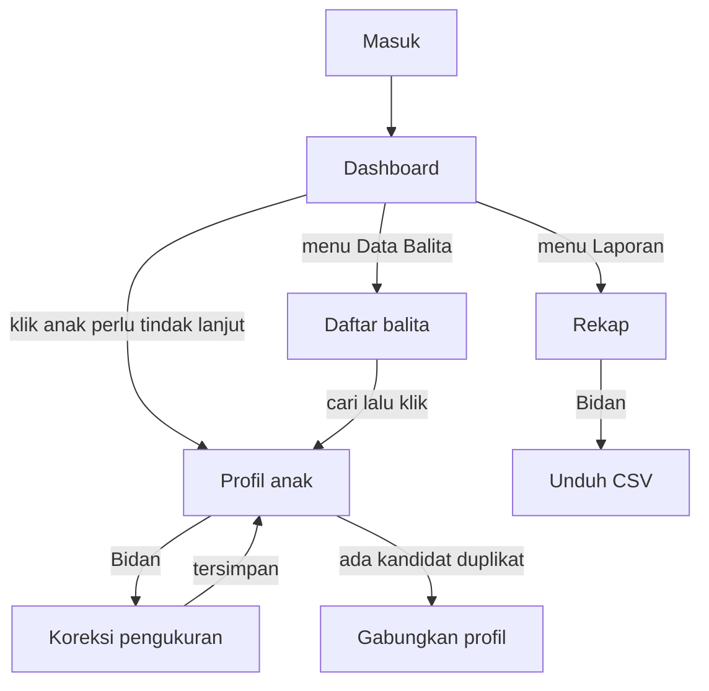

# UI/UX Specification — Portal Posyandu Tulip

| | |
|---|---|
| **Jenis** | Rujukan |
| **Status** | hidup — sebagian, menunggu [OI-08](../pertanyaan-terbuka.md) |
| **Perubahan berarti terakhir** | 22 September 2026 |

> **Status dokumen: token dan warna sudah diselaraskan** dengan prototipe desain Portal di `docs/design/` (ditarik 9 September 2026). [OI-08](../pertanyaan-terbuka.md) selesai.
>
> Bagian **2, 3, dan 8** bersumber langsung dari `portal-prototipe.html` dan `portal-layar-desktop-v2.html`.
> **Geometri bagian 2.5 ditarik ulang dari `portal-prototipe-v2.html` pada 11 September 2026** — lihat bagian 2.7 untuk apa yang diambil dan apa yang ditahan.
> Bagian **2, 3, dan 4** adalah sumber tunggal token, warna status, dan daftar komponen — [`rujukan/layar-demo.md`](layar-demo.md) bagian 8 menunjuk ke sini dan tidak menyalinnya.
> Bagian **5** menetapkan Portal yang **dituju**; ketujuh layar yang dirancang untuk demo ada di [`rujukan/layar-demo.md`](layar-demo.md) bagian 6 — enam di antaranya sudah dibangun, halaman Periode belum. Keduanya sengaja berbeda di beberapa tempat — itu jarak antara rencana dan keadaan, bukan salah ketik.
>
> ⚠️ `portal-sistem-desain.html` adalah sistem desain **aplikasi tablet** (lansia-first, dasar 18 px), **bukan Portal**. Nilainya tidak berlaku di sini.

---

## 1. Prinsip desain

| # | Prinsip | Konsekuensi konkret |
|---|---|---|
| P1 | **Kader bukan pengguna komputer harian.** | Tidak ada ikon tanpa teks. Tidak ada gerakan tersembunyi. Aksi merusak selalu meminta konfirmasi bertulis, bukan sekadar tombol merah. |
| P2 | **Angka kesehatan tidak boleh ambigu.** | Nilai kosong ditampilkan sebagai `—`, tidak pernah sebagai `0`. Satuan selalu tertulis. Status selalu berupa teks, warna hanya pendukung. |
| P3 | **Data yang salah harus terlihat, bukan tersembunyi.** | Nilai bertanda `tidak_wajar` tetap ditampilkan dengan penanda, bukan disaring keluar. |
| P4 | **Asumsi sistem harus terlihat.** | Bila `jenis_ukur` diasumsikan dari umur, keterangan itu muncul di antarmuka, bukan hanya di basis data. |
| P5 | **Bahasa Indonesia sepenuhnya.** | Termasuk pesan validasi dan nama kolom. Istilah medis baku dipertahankan (*stunting*, z-score) karena itulah yang dipakai kader dan Puskesmas. |

---

## 2. Design tokens

Diambil langsung dari `docs/design/portal-prototipe.html` dan `portal-layar-desktop-v2.html`, dengan frekuensi pemakaian sebagai dasar penentuan peran tiap nilai.

### 2.1 Permukaan dan teks

| Peran | Nilai | Catatan |
|---|---|---|
| `background` | `#FFFFFF` | Latar halaman dan kartu. Permukaan dominan. |
| `sidebar` | `#F6F7F5` | Sidebar tetap. |
| `surface-subtle` | `#F1F3EF` | Blok catatan dan bagian sekunder di dalam kartu. |
| `surface-alt` | `#EDEFEA` | Header tabel, latar chip netral. |
| `foreground` | `#16211C` | Teks utama. Kontras 16,6:1 di atas putih. |
| `muted-foreground` | `#4A5750` | Teks sekunder. Nilai paling sering dipakai di seluruh prototipe desain. Kontras 7,6:1. |

### 2.2 Garis

| Peran | Nilai |
|---|---|
| `border` | `#C2C9C0` |
| `border-soft` | `#D5DBD2` · `#CFD5CB` · `#C3C9C0` |
| `border-strong` | `#8B948C` — 3,1:1 di atas putih, memenuhi syarat komponen non-teks |

**Direvisi 11 September 2026.** Semula `#DCE0DA` (1,3:1) dan `#A8B0A9` (2,3:1), dan tidak satu pun memenuhi 3:1. Untuk mata menua, garis tabel yang tak terlihat berarti tabel tanpa struktur — dan tabel adalah bentuk utama produk ini. `border-strong` kini memenuhi 3:1; `border` tetap di bawahnya dengan sengaja, karena garis pemisah 101 baris yang terlalu pekat membuat tabel terbaca seperti jeruji.

Syarat bagian 8 tetap berlaku: **tepi kotak tidak pernah menjadi satu-satunya penanda sebuah kontrol.**

### 2.3 Merek dan nada keparahan

Prototipe desain mendefinisikannya sebagai konstanta, jadi nilainya pasti — bukan hasil terkaan dari pemakaian.

| Nada | Teks | Latar | Arti |
|---|---|---|---|
| Merek | `#0F6E44` | `#E9F3EC` | Aksi utama, tautan aktif |
| Perlu tindakan | `#A3170F` | `#FCEDEC` | Perlu dirujuk atau ditindaklanjuti bulan ini |
| Perlu perhatian | `#9A5B00` | `#FBF1E3` | Pantau lebih dekat, belum mendesak |
| Baik | `#0F6E44` | `#E9F3EC` | Sesuai untuk umurnya |
| Catatan | `#1148A8` | `#EAF0FB` | Dicatat, tidak mendesak |
| Netral | `#4A5750` | `#EDEFEA` | Belum ada data |

`#EAAA08` **dilarang sebagai warna teks** — kontrasnya 2,1:1. Teks peringatan memakai `#9A5B00`.

### 2.4 Tipografi

| Token | Nilai |
|---|---|
| Keluarga huruf | `Plus Jakarta Sans`, jatuh ke `system-ui, sans-serif` |
| Isi | **18 px** |
| Label, chip, header tabel | **16 px** — batas terkecil, tidak diturunkan lagi |
| Subjudul | 20 · 21 · 22 px |
| Judul | 26 px |
| Angka besar | 32 · 40 px |
| Angka | `font-feature-settings: "tnum" 1, "lnum" 1` pada `body` dan `input` |

Angka **wajib** *tabular*. Tanpa itu kolom berat dan z-score tidak sejajar, dan tabel adalah bentuk utama produk ini.

> **Direvisi 11 September 2026.** Semula Portal memakai 17/15 px dengan alasan ia dibaca sambil duduk. Alasan itu benar tentang jaraknya, tapi salah tentang matanya: kader dan bidan Posyandu Tulip rata-rata bukan pengguna komputer harian **dan** tidak muda. 15 px justru dipakai label, header tabel, dan baris alasan di Beranda — teks yang paling perlu terbaca. Skalanya naik ke 18/16 px.
>
> Ini **bukan** mengadopsi sistem desain Aplikasi Tablet. Tablet memakai 18 px dengan target 56 px karena dipakai sambil berdiri memegang perangkat; Portal naik ke 18 px dengan target 52 px (bagian 2.5) karena dipakai duduk. Keduanya tetap sengaja berbeda — yang berubah hanya jarak antara keduanya.

### 2.5 Bentuk, jarak, target

| Token | Nilai |
|---|---|
| Radius kartu dan blok | **20 px** |
| Radius tombol dan field | **14 px** |
| Radius chip | **10 px** |
| Pil | 999 px |
| Jarak | kelipatan 4 px |
| Target sentuh | **52 × 52 px** minimum (tablet 56 px) |
| Bayangan | `0 4px 14px rgba(22,33,28,0.04)`, satu tingkat; kedalaman tetap terutama dinyatakan garis tepi |

> **Direvisi 11 September 2026, mengikuti `portal-prototipe-v2.html`.** Semula 8/10/6 px dengan target 48 px. Lihat bagian 2.7 untuk apa yang diambil dan apa yang tidak.

### 2.6 Penerapan

Token ditulis sebagai CSS variable di `client/src/app.css`, mengganti nilai netral bawaan shadcn. Nama variabel bawaan shadcn (`--background`, `--primary`, `--border`, dan seterusnya) **tidak diubah**, sehingga seluruh komponen `components/ui/**` ikut berubah tanpa disentuh.

Token tambahan yang tidak ada di shadcn — `--sidebar-surface`, `--surface-subtle`, `--tone-red`, `--tone-amber`, `--tone-blue` beserta latarnya — ditambahkan di blok `@theme` yang sama.

Mode gelap **tidak dibangun**. Prototipe desain mengunci tema terang, dan dukungan dua tema menggandakan biaya verifikasi kontras tanpa pemakai yang menuntutnya.

Lima bentuk yang berulang di seluruh produk — `.kartu`, `.strip-kepala`, `.tombol-utama`, `.tombol-kedua`, `.isian` — ditulis sekali di blok `@layer components` pada berkas yang sama. Sebelumnya keenam halaman menyalin rangkaian utilitas yang sama puluhan kali, sehingga mengubah radius kartu berarti menyisir enam berkas `.tsx`.

---

### 2.7 Apa yang diambil dari Prototipe v2, dan apa yang tidak

`portal-prototipe-v2.html` ditarik 11 September 2026. **Geometrinya diikuti; warnanya tidak.**

Diambil: radius 20/14/10 px, tinggi kontrol 52 px, dasar halaman `#EDEFEA` dengan isi di atas kartu putih `#FFFFFF`, strip kepala `#F6F7F5` bergaris bawah 2 px, bilah kepala layar setinggi 76 px, judul 28 px dan angka besar 36 px, bayangan kartu satu tingkat.

Ditahan, dengan alasan:

| v2 meminta | Yang dipakai | Alasan |
|---|---|---|
| `border` `#DCE0DA` | `#C2C9C0` | 1,3:1 terhadap putih, di bawah syarat 3:1 komponen non-teks (bagian 2.2) |
| `border-strong` `#A8B0A9` | `#8B948C` | 2,3:1, idem |
| Merah `#B42318` | `#A3170F` | nada keparahan bagian 2.3 sudah diselaraskan dengan sistem desainnya |
| Tanpa nada biru; `Berisiko gizi lebih` jadi oranye | Biru `#1148A8` | kategori yang hanya perlu dicatat tidak boleh terbaca sebagai perlu perhatian (bagian 3, OI-11) |

Dua akibat dari dasar halaman yang berubah abu, ditemukan saat verifikasi dan sudah diperbaiki:

- `EmptyState` semula berlatar `#F1F3EF` — hanya 1,04:1 terhadap dasar baru, keadaan kosong yang sendirinya tidak terlihat. Kini kartu putih.
- Pil hitung "0 anak" di Beranda berlatar `#EDEFEA` di atas strip `#F6F7F5`, 1,08:1. Nol kini ditulis sebagai teks biasa, tanpa pil.

`--surface-alt` `#EDEFEA` kini bernilai sama dengan dasar halaman. Ia masih dipakai chip netral dan kepala tabel, keduanya **selalu berada di atas kartu putih**; jangan memakainya langsung di atas dasar halaman.

---

## 3. Warna status gizi

Empat nada keparahan pada bagian 2.3 dipetakan ke kategori resmi PMK No. 2 Tahun 2020. Pemetaan ini hidup di satu tempat saja: `components/status-gizi-badge.tsx`.

| Indeks | Rentang z | Kategori resmi | Nada |
|---|---|---|---|
| **BB/U** | `< -3` | Berat badan sangat kurang | Merah |
| | `-3` … `< -2` | Berat badan kurang | Oranye |
| | `-2` … `+1` | Berat badan normal | Hijau |
| | `> +1` | Risiko berat badan lebih | Biru |
| **PB/U · TB/U** | `< -3` | Sangat pendek | Merah |
| | `-3` … `< -2` | Pendek | Oranye |
| | `-2` … `+3` | Normal | Hijau |
| | `> +3` | Tinggi | Biru |
| **BB/PB · BB/TB · IMT/U** | `< -3` | Gizi buruk | Merah |
| | `-3` … `< -2` | Gizi kurang | Oranye |
| | `-2` … `+1` | Gizi baik | Hijau |
| | `> +1` … `+2` | Berisiko gizi lebih | Biru |
| | `> +2` … `+3` | Gizi lebih | Oranye |
| | `> +3` | **Obesitas** | Merah |
| **LIKA/U** | `< -2` | Mikrosefali | Oranye |
| | `-2` … `+2` | Normal | Hijau |
| | `> +2` | Makrosefali | Oranye |
| **LILA/U** | — | belum ada label ([OI-04](../pertanyaan-terbuka.md)) | Netral |

Aturan mengikat: **warna tidak pernah menjadi satu-satunya penanda.** Setiap chip berisi ikon, teks kategori, dan warna sekaligus. Laporan Posyandu dicetak hitam-putih, dan harus tetap terbaca.

Ikon per nada, Phosphor `bold`: segitiga seru penuh (merah) · segitiga seru garis (oranye) · centang (hijau) · info (biru).

### ⚠️ Dua penyimpangan pada prototipe desain

Ditemukan saat membaca `portal-prototipe.html`; keduanya perlu diperbaiki saat implementasi:

| Temuan | Akibat |
|---|---|
| `wflClass()` **tidak punya cabang Obesitas** — berhenti di `Gizi lebih` untuk semua `z > +2` | Data Juni 2026 punya **3 anak obesitas**; di prototipe desain mereka terbaca `Gizi lebih`, satu tingkat lebih ringan dari keadaan sebenarnya |
| `wazClass()` dan `wflClass()` memakai oranye untuk `Risiko berat badan lebih` dan `Berisiko gizi lebih`, sedangkan sistem desain menetapkan biru | Kategori yang sekadar perlu dicatat terbaca sebagai perlu perhatian |

Implementasi mengikuti tabel di atas, bukan kode prototipe desain. Tercatat sebagai [OI-11](../pertanyaan-terbuka.md).

---

## 4. Inventory komponen

Bagian ini adalah **sumber tunggal** daftar komponen. [`rujukan/layar-demo.md`](layar-demo.md) bagian 8.3 menunjuk ke sini, tidak menyalinnya.

> **Direvisi 22 September 2026.** Bagian 4.1 dulu mendaftar dua puluh komponen shadcn bawaan *starter kit* sebagai "sudah ada, dipakai apa adanya". Seluruhnya **ikut terhapus** bersama stack lama ([ADR-0006](../adr/0006-pindah-ke-express-react-postgres.md)); yang tersisa hanya `table.tsx`. Daftar lama itu membuat komponennya tampak tinggal dipakai, padahal sudah tidak ada.

### 4.1 Sudah ada di repo

| Komponen | Keterangan |
|---|---|
| `ui/table.tsx` | Satu-satunya komponen shadcn yang tersisa. Dipakai keempat layar bertabel: Data Balita, Detail anak, Laporan, Pengaturan |

### 4.2 Perlu ditambahkan

| Komponen | Alasan |
|---|---|
| `ui/pagination.tsx` | Navigasi halaman untuk daftar anak dan rekap. Belum ada |

Komponen shadcn lain ditarik satu per satu **saat benar-benar dibutuhkan**, bukan diborong di muka. Yang sebelumnya diborong terbukti tidak terpakai dan ikut terhapus tanpa kehilangan apa pun.

### 4.3 Komponen domain

Ketujuhnya ada di `client/src/components/`.

| Komponen | Isi |
|---|---|
| `status-gizi-badge.tsx` | Label kategori berwarna. **Sumber tunggal** pemetaan bagian 3 |
| `kms-chart.tsx` | Kurva pertumbuhan. **SVG langsung, tanpa library chart.** Yang dibutuhkan hanya beberapa `path` garis SD dan sederet titik; membuat library chart menggambar overlay SD menuntut kustomisasi yang lebih panjang daripada SVG-nya sendiri |
| `z-score-cell.tsx` | Sel tabel z-score: dua desimal, `—` bila kosong, penanda bila `tidak_wajar` |
| `filter-periode.tsx` | Pemilih periode, dipakai ulang di header, Beranda, dan Laporan |
| `empty-state.tsx` | Menyebutkan sebab dan menawarkan jalan keluar, bukan sekadar "tidak ada data" |
| `baris-definisi.tsx` | Pasangan label–nilai pada blok Identitas Detail anak |
| `halaman.tsx` | Kerangka halaman: judul, subjudul, dan bilah aksi |

### 4.4 Dihapus dari tampilan

| Komponen | Alasan |
|---|---|
| `team-switcher.tsx` | Hanya ada satu Posyandu. Komponennya sudah ikut terhapus bersama stack lama ([ADR-0006](../adr/0006-pindah-ke-express-react-postgres.md)). |
| Entri nav "Teams" pada layout pengaturan | idem. Konsep *team* tidak ikut pindah; tabelnya kini bernama `posyandu`. |

---

## 5. Struktur halaman

> **Ini struktur Portal yang dituju, bukan yang sudah dibangun.** Sebagian isinya belum ada di demo — tren stunting per RT pada 5.2, misalnya. Tata letak persis, susunan kartu, bunyi kalimat, dan state kosong dari yang **benar-benar dibangun** ada di [`rujukan/layar-demo.md`](layar-demo.md) bagian 6. Bila keduanya berbeda, di sinilah rencananya dan di sana keadaannya.

### 5.1 Navigasi

Sidebar tetap (komponen `sidebar` bawaan, varian `inset`):

```text
Posyandu Tulip
├── Dashboard
├── Data Balita
├── Periode
└── Laporan
    └── Rekap
```

Entri "Periode" hanya tampil bagi Admin. Menu Pengaturan tetap berada paling bawah.

### 5.2 Dashboard

| Bagian | Isi |
|---|---|
| Pemilih periode | Default: periode terbaru. |
| Kartu ringkasan | Sasaran (S), Ditimbang (D), D/S dalam persen, jumlah anak perlu tindak lanjut. |
| Sebaran status gizi | Tiga indeks inti, masing-masing menampilkan jumlah anak per kategori. |
| Tren stunting | Persentase `TB/U < -2 SD` per periode, per RT. |
| Daftar tindak lanjut | Anak dengan kategori bermasalah. Disusun dari status gizi saja — **bukan** dari 1T/2T/3T (OI-01). |

### 5.3 Data Balita — daftar

Tabel dengan pencarian di atasnya. Kolom: Nama, NIK, JK, Umur, RT, Pengukuran terakhir, Status BB/TB, Status TB/U.

Filter: RT, status anak, periode, kategori status gizi. Pencarian mencakup `nama` dan `nama_baku` sekaligus.

Baris dapat diklik untuk membuka profil. Tombol "Tambah Anak" hanya tampil bagi Bidan ke atas.

### 5.4 Profil anak

| Bagian | Isi |
|---|---|
| Identitas | Nama, NIK, tanggal lahir, umur berjalan, JK, RT, orang tua, status. Penanda bila ada kandidat duplikat. |
| Kurva KMS | Garis SD sebagai latar, titik pengukuran anak di atasnya. Indeks dapat dipilih. |
| Riwayat pengukuran | Satu baris per periode: tanggal, BB, TB/PB beserta jenis ukurnya, LILA, LIKA, lalu enam pasang kolom z-score dan status. |
| Layanan | Imunisasi, Vitamin A, obat cacing. Kosong sampai ada sumber data. |
| Aksi | Ubah profil, koreksi pengukuran, gabungkan duplikat — sesuai peran. |

Baris riwayat yang memuat asumsi (mis. `jenis_ukur` ditebak dari umur) menampilkan keterangan itu — prinsip P4.

### 5.5 Rekap

Tabel lebar dengan susunan kolom sesuai FR-23. Karena lebarnya, tabel **menggulir di dalam wadahnya sendiri**; badan halaman tidak pernah menggulir horizontal (NFR-02). Kolom Nama dibekukan di kiri.

Filter: periode, RT, indeks, kategori. Tombol Unduh CSV hanya untuk Bidan ke atas.

### 5.6 Periode

Daftar periode beserta jumlah pengukurannya. Aksi buat dan ubah hanya untuk Admin.

---

## 6. Alur pengguna



Alur terpendek yang paling sering dipakai — kader mencari seorang anak lalu membaca riwayatnya — harus selesai dalam **dua klik dari Dashboard**.

---

## 7. Responsif

| Lebar | Perilaku |
|---|---|
| ≥ 1280 px | Sidebar terbuka; tabel tampil penuh. |
| 1024–1279 px | Sidebar dapat diciutkan menjadi ikon. |
| 768–1023 px | Sidebar menjadi *sheet*; tabel lebar menggulir di dalam wadahnya. |
| < 768 px | Didukung sebatas dapat dibaca, tidak dioptimalkan. Pemakaian di ponsel bukan sasaran Portal. |

Aturan mengikat: **badan halaman tidak pernah menggulir horizontal.** Konten lebar — tabel, grafik — menggulir di dalam wadahnya sendiri.

---

## 8. Aksesibilitas

Kebutuhan minimum, bukan kemewahan (NFR-12). Rasio di bawah dihitung dari pasangan warna yang benar-benar dipakai `Portal Posyandu - Prototipe (standalone).html`.

| Pasangan | Rasio | Putusan |
|---|---|---|
| `#16211C` di atas `#FFFFFF` | 16,6:1 | lulus AAA |
| `#4A5750` di atas `#FFFFFF` | 7,6:1 | lulus AAA — teks sekunder 15 px aman |
| `#4A5750` di atas `#F6F7F5` (sidebar) | 7,1:1 | lulus AAA |
| `#0F6E44` di atas `#FFFFFF` | 6,3:1 | lulus AA |
| `#FFFFFF` di atas `#0F6E44` (tombol utama) | 6,3:1 | lulus AA |
| `#0F6E44` di atas `#E9F3EC` (chip hijau) | 5,6:1 | lulus AA |
| `#A3170F` di atas `#FCEDEC` (chip merah) | 6,9:1 | lulus AA |
| `#9A5B00` di atas `#FBF1E3` (chip oranye) | 4,9:1 | lulus AA, margin tipis — latarnya tidak boleh digelapkan |
| `#1148A8` di atas `#EAF0FB` (blok catatan) | 7,3:1 | lulus AA |

Warna garis tidak memenuhi 3:1 untuk komponen non-teks: `#DCE0DA` 1,3:1 · `#D5DBD2` 1,4:1 · `#CFD5CB` 1,5:1 · `#A8B0A9` 2,2:1. Diterima sebagai garis dekoratif, dengan syarat **tepi kotak tidak pernah menjadi satu-satunya penanda sebuah kontrol** — setiap input punya label teks di atasnya dan setiap tombol punya teks di dalamnya. `#EAAA08` (2,1:1) tetap dilarang sebagai warna teks; teks peringatan memakai `#9A5B00`.

| Aspek | Aturan |
|---|---|
| Fokus | `outline: 2px solid #0F6E44; outline-offset: 1px`. Prototipe desain memasangnya pada `input:focus-visible`; implementasi memberlakukannya ke **semua** kontrol — nav, chip filter, tombol baris, tautan Detail. |
| Elemen interaktif | Prototipe desain memakai `<span role="button" tabindex="0">` karena kanvas desain tidak punya `<button>`. Implementasi memakai `<button>` dan `<a>` asli, bukan meniru pola itu. |
| Target sentuh | Nilainya ditetapkan bagian 2.5 — **52 × 52 px**, batas bawah, tidak diturunkan. Sempat tertulis 44 px di sini sampai 22 September 2026, sisa sebelum revisi 11 September; bagian 2.5 yang berlaku. |
| Label | Label permanen 15/600 di atas setiap field. `placeholder` dikosongkan dan tidak pernah menggantikan label. |
| Ikon | Phosphor `bold` 20–24 px, selalu berpasangan dengan teks. Satu-satunya ikon tanpa teks adalah panah kembali di header Detail anak — wajib `aria-label="Kembali ke Data Anak"`. |
| Status | Tidak pernah disampaikan lewat warna saja — selalu ada teks kategori (bagian 3). |
| Tabel | Daftar anak di prototipe desain adalah CSS grid; implementasi memakai `<table>` dengan `<th scope="col">`. Tabel riwayat pengukuran dan rekap per RT di prototipe desain sudah `<table>`. |
| Angka | `font-feature-settings: "tnum" 1, "lnum" 1` di `body` dan `input`, agar kolom angka sejajar dan tidak bergeser saat diketik. |
| Teks terkecil | 15 px, untuk label, chip, dan header tabel. Di bawah itu tidak ada. Prototipe tablet melarang di bawah 18 px; Portal turun ke 15 px karena dibaca duduk pada jarak dekat, dan batas ini tidak diturunkan lagi. |
| Gerak | **Diperbarui 17 September 2026.** Prototipe desain tidak memakai animasi sama sekali. Feedback lapangan dikonfirmasi meminta animasi sederhana tapi menarik — implementasi tetap wajib hormati `prefers-reduced-motion`. Daftar konkret elemen yang dianimasikan menyusul di fase desain, supaya tidak menebak dan bertentangan dengan P1 (kesederhanaan untuk kader non-teknis). |
| Bahasa | `<html lang="id">`. |

Prototipe desain tidak memuat satu pun atribut `aria`. Itu batas kanvas desain, bukan keputusan desain: kelengkapan semantik — `<button>`, `<th scope>`, `aria-label` pada ikon tunggal, `aria-live` pada banner "belum terkirim" — adalah kewajiban implementasi.

---

## 9. Aturan penulisan antarmuka

| Konteks | Aturan | Contoh |
|---|---|---|
| Nilai kosong | `—`, tidak pernah `0` atau kosong melompong | `BB: —` |
| Satuan | Selalu ditulis | `7,02 kg` · `67,0 cm` |
| Desimal | Koma sebagai pemisah desimal | `−1,23` |
| Z-score | Dua desimal, dengan tanda | `−2,15` |
| Tanggal | `13 Jun 2026` di tabel, `13 Juni 2026` di teks | |
| Umur | Bulan penuh, dengan tahun bila ≥ 12 bulan | `4 bulan` · `2 tahun 3 bulan` |
| Tombol | Kata kerja, bukan kata benda | `Simpan Perubahan`, bukan `Penyimpanan` |
| Konfirmasi merusak | Menyebut objeknya secara spesifik | `Hapus pengukuran Juni 2026 untuk Ahmad?` |
| Pesan kesalahan | Menyebut apa yang salah dan apa yang harus dilakukan | `Berat badan harus antara 0,5 dan 40 kg.` |
| Keadaan kosong | Menjelaskan sebab, bukan sekadar "tidak ada data" | `Belum ada pengukuran pada periode ini.` |
